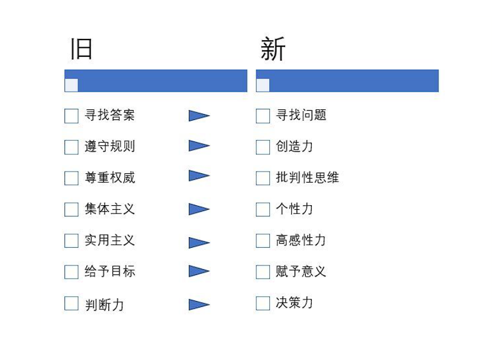
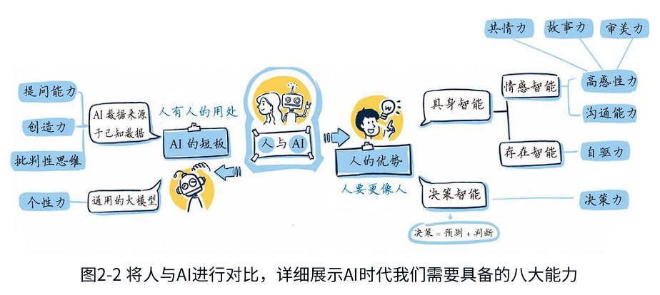

人工智能的革命注定会对人类社会的方方面面造成影响，我们唯一能走的路只有适应和理性应对。不管人工智能如何变革，掌握批判性思维和逻辑能力是创新和适应未来发展的根本保障，也是人工智能产生的根本原因。

# 人能学过机器吗？

**每一次重大的技术进步都伴随着教育模式的转变**。如今，随着第四次工业革命的到来，AI技术的发展让我们又一次站在了教育变革的风口。现在，人工智能不再仅仅是技术人员的专属领域，它已渗透到每个人的日常生活中，其影响之广泛、未来之光明，是每个人都无法回避的话题。

学习不仅是知识和信息的积累，还是认知能力、适应能力、创新能力和合作能力的综合体现。**人的学习包含了情感维度和社交维度**，这是目前的人工智能所不具备的。

当前，人工智能通过机器学习、深度学习等技术，展现出了惊人的学习能力和适应能力。它们能够在短时间内掌握和执行复杂任务，可以处理文本、图片、音视频等多种类型的数据。然而，机器的这种“学习”依赖于大量数据的输入，以及整体以概率论为基础的数学运算，并不适合与人类的学习能力相提并论。

人类不仅能从经验中学习，还能通过抽象思维、想象和直觉来解决问题。我们能在阅读文学作品时体会到作者的情感，在看到一幅画时感受到画家的意图，在听一段音乐时领悟到作曲家的创作灵感，这些都是AI目前还无法企及的。

更何况，人类社会的学习不仅仅是个体的学习，更是集体智慧的积累。我们通过交流、协作和教育，共同创造出文化和知识的宝库。AI可以成为这个过程中的工具，帮助我们更有效地学习和工作，但它无法取代人在这个过程中的角色。

因此，当我们谈论“学习”时，不能仅仅关注信息的处理和任务的执行，还应关注**创造力**、**批判性思维**、**情感表达**和**社交能力**的培养。在这些领域，人不仅能学过机器，而且必须学过机器。我认为，未来的教育不应单一地侧重于知识的传授，而应更加注重培养学习者的这些能力。

* AI时代必备的八大能力，包括提问能力、创造力、批判性思维、个性力等，这是每个人在未来社会中的立足之本。

AI时代的8项核心必备技能—**提问力、创造力、批判性思维、个性力、高感性力、沟通能力、自驱力和决策能力**，这是每一位学习者在未来世界中立足的基石。这些技能不仅仅是学术知识的累积，也是个人综合素质的体现，除了适用于学生，还适用于所有想在这个快速变化的时代保持竞争力的人。此外，这些技能不仅仅是职业成功的关键，也是我们作为人类独特的、不可被AI替代的品质。

在AI时代，编程不再是一门技术学科，它已转化为一种思维方式、一种解决问题的方法。数学、艺术、语言等传统学科也在新的学习环境中焕发出了新的生命力，这些学科不仅为AI提供了基础，也在培养我们的逻辑思维、创造力和人际交往能力方面起到了不可替代的作用。

在未来的工作环境中，AI将扮演越来越重要的角色，因此我们必须学会与之协作，发挥自己的独特优势。与其被动地适应技术的变化，我们更应该主动地利用这些变化来提升生活品质和工作效率。这就要求我们不仅要学习如何使用新技术，也要理解这些技术背后的原理和逻辑，培养一种终身学习的心态，不断适应变化的环境。

我在日常工作中经常会遇到棘手的问题，这就要求我必须先明确要解决的问题或实现的目标，然后拆解目标或问题以找到实现路径，最终确定完成路径所需的资源。虽然AI技术可以在实现路径的拆解和资源建议上提供有效帮助，但在明确目标方面它无法主动提出有价值的建议，更多时候是被动接受信息并进行相应的信息处理和加工。因此，我们的想象力、提问能力、判断和选择能力，以及沟通和反馈能力，将决定我们能否让AI为我们提供最有价值的信息。这些能力与我们的目标设定、热情和兴趣所在，以及想要的生活方式密切相关，而且与内在情感德性交融促进。我觉得这就是教育的价值所在，也是个人成长的魅力。

## 工作里的难题通常是“问题不清晰”的问题

很多棘手问题不是“不会算”，而是问题本身还没被结构化：目标、约束、成功标准都模糊。这类问题在认知科学里常被称为 ill-structured / ill-defined problems（非良构问题）。Simon 早就指出“良构/非良构”的边界很模糊，而很多真实世界任务看起来就是非良构的。

## 解决复杂问题的流程：目标 → 拆解 → 路径 → 资源

* 明确要解决的问题/目标（定义成功是什么）

* 拆解目标（把大问题变成可执行子问题）

* 找实现路径（步骤、方案、权衡）

* 确定资源（数据、人、时间、工具、权限）

## 为什么说 AI 在“明确目标”上不够主动？

因为大多数对话式 AI 的工作机制是：**你给一个目标/约束 → 它在这个框架内生成内容**。它可以帮你“把问题讲清楚”，但它很难替你决定：

* 你真正想要的结果是什么？

* 你愿意牺牲什么来换取它？

* 你面对的真实约束是什么？

* 哪个风险你承担？

## 所以决定 AI 价值的，是人的这些“上游能力”

* 想象力：能提出可能的目标与替代方案（不被默认方案绑架）

* 提问能力：能把模糊意图变成可回答的问题（问题框定 / framing）

* 判断与选择：能评估 AI 输出是否靠谱、是否适用、取舍是什么

* 沟通与反馈：能把背景、约束、偏好讲清，并能纠错迭代

## 为什么这些能力和“热情/兴趣/生活方式”绑在一起？

因为目标不是纯理性的数学题，它包含价值判断：

* 你在乎什么（成就、稳定、自由、影响力、健康、关系……）

* 你愿意长期投入什么（兴趣/热情决定持续性）

* 你讨厌什么（生活方式的边界/底线）

* 你想成为什么样的人（身份认同）

# AI时代的儿童教育

鹌鹑在蛋壳里的时候是接收不到光的，只有从蛋壳里出来，光线刺激进入眼睛，它的视觉才开始发育。有一些研究者做了这样一个实验：在小鹌鹑出生的两天前，他们把它的壳剥掉，然后用强弱交替变化的光驱照射鹌鹑，结果，鹌鹑的视觉提前发育了。但是由于这个时候正好是鹌鹑听觉的发育时期，提前出现的光刺激损伤了它的听觉的正常发育，使得鹌鹑再也无法识别妈妈的声音了。可见，动物的成长是有顺序的，从触觉到空间平衡感，再到味觉、嗅觉、听觉和视觉，如果打破这一顺序，则会导致发育紊乱。

鹌鹑尚且如此，那么学生呢？著名儿童心理学家让·皮亚杰(Jean Piaget)在经过大量研究后发现，儿童的发展（包括智力、情绪和社会适应）也是有顺序的，在不同的发展阶段，应该学习与该年龄阶段相适应的内容，如果过早学习不符合认知范围的内容，则只会事倍功半。

例如，7岁前的孩子属于前运算阶段，连基本的抽象思维都没有建立，有些家长就急着让他们学习初中的代数和几何，这样无疑打乱了他们的发展顺序。事实上，那些在较小年龄需要用至少半天时间才能理解（或者死记硬背了算法，却不能理解本质）的知识，在孩子上了初中之后，只需要花半小时就能学会。这样看来，过早学习完全是得不偿失。

原因主要有以下3点。第一，本来孩子可以用更多的时间去玩耍，却在小小年纪花费了大量的时间学习所谓的知识，损害了孩子的身心健康。第二，在学到这点儿知识后，孩子最开始可能会比别人有一定优势，但随着年级的升高，这点儿优势会荡然无存，这在教育学上叫作“凋零效应”​。第三，提前学习这些知识时，孩子不会去探究数学的本质，反而养成了死记硬背公式的习惯，丧失了对学习的好奇心和进行探究的动力，完全不值得。

这让我不禁反思：当下应该怎么做？因此，我问了自己如下几个问题。
(1)既然ChatGPT在标准化考试中已经这么厉害了，那么我们还有必要“卷”成绩吗？

(2)这种以牺牲孩子身心健康为代价的“内卷”有意义吗？

(3)用拼命考高分的方式去应对未来的挑战，是不是“刻舟求剑”呢？

(4)当下的教育投入产出比与我们那个时代还一样吗？

(5)我们现在的焦虑在未来看起来会不会是一个笑话？

AI时代对人才的要求正在发生根本性的变化。在这个以数据和技术为驱动的时代，创造力、批判性思维、跨学科学习能力和终身学习的意愿变得尤为重要。

我想回答下面几个问题。

(1)以ChatGPT为代表的新一轮人工智能的发展到底能否真正改变教育？

(2)如果AI时代必将到来，我们要如何面对？可以做哪些准备？孩子们需要发展什么样的能力（或者老师需要培养学生掌握什么样的能力）​？

(3)在无法改变现有考试制度的前提下，如何平衡学业成绩与未来发展的关系？

(4)在AI时代，如何做好当下的选择，比如奥数、编程、绘画等还要不要学？什么样的专业和工作更符合未来发展的趋势？

(5)未来教育、未来学校会是一副什么模样？

# 人工智能重塑教育

## 什么是理想教育？

教育系统有两大功能：一是选拔人才，二是培养人才。与此对应，就使得教育具有两个属性：一个是工具属性，比如帮助学生考上好大学、找好工作等；另一个是价值属性，比如帮助学生成为内心充盈、懂得生活的人。

然而，在某种意义上，​“选拔人才”和“培养人才”这两项职责是相互矛盾的：只要有选拔，就意味着有淘汰。只要有淘汰，就意味着肯定有一部分人不能被培养，或者不能被同等程度地培养。只要有淘汰，人们就会趋之若鹜地让自己成为那个不被淘汰的人，​“内卷”由此形成。只要有淘汰，有人就可能从选拔方法里面钻空子、找路子，使得选拔无法做到完全的公平客观，导致选拔可能失效。

所以我认为，解决培养人的问题的最根本方法就是不设立选拔机制。根据霍华德·加德纳(Howard Gardner)的“多元智能理论”​，每一个孩子都有自己的天赋，可能体现在音乐智能、体育智能、空间智能、语言智能等八大维度，因此，教育工作者的任务是发现每一个孩子的独特方面并加以培养，让每一个孩子都被看见，并在他们所擅长的领域开花结果。

但这仅仅是从一个角度来考虑是否要“选拔”​，实际上，​“选拔机制”对社会的影响远远不能只从单一的维度去考量和决策。要知道，选拔人才的方式从古至今都是存在的，它是维持社会正常秩序、保持阶层流动、维护社会稳定必不可少的重要举措之一，从这个方面来考虑，它的意义和价值也完全不同。因此，不能简单地一刀切，说取消就取消。这里我们只是说，单纯从培养人才的角度，可能没有选拔机制会更好。

## 学校

学校的管理更加去中心化，可能没有固定的校园、围墙和教室，也没有固定行政班的概念，采用小班化教学，没有年龄的限制，不同年龄的孩子混在一起学习，学制更加弹性化，可以根据学生的学习情况延长或者缩短。

学校之间的差别不大，每个学生在任何一所学校都能受到良好的教育，而且，并非每个学生都要上大学，有没有大学文凭与是否有好的工作关系不大。学校更类似于“创新工场”或者“学业孵化器”​，不仅为学生的学习提供服务，也为学生解决真实问题提供服务。

学校的主要功能不是向学生传授知识，而是为他们提供一个社交场所。社交对于学习具有十分重要的作用，它可以促进学生之间的互动交流，有相同兴趣的学生可以聚在一起讨论，碰撞出思想的火花。学生在学习期间可以学任何自己感兴趣的学科内容，如果萌生了好的想法，那么可以申请学期间隔(gap year)，在休学期间把想法实现成产品，进行商业化应用。

## 学生

学生对知识具有强烈的渴望和好奇心，愿意自由探索，具有自主学习的能力，可以自己决定学习什么科目以及学习的进度、难度、深度和广度，不用为了考试而学习，也不必追求学科的完整性和系统性。

学习方式是项目式、体验式、探究式的，学习的重点不仅仅是知识本身，还要理解一个学科的**方法论和思维方式**，并且着眼于解决真实的问题，从“因知而行”变成“因行而知”​。

## 老师

老师关心每一个学生的发展，清楚地了解每一个学生的不同特点，他们不仅仅会在学业上给予指导，也会在思维方式上予以引导，从而做到因材施教、有教无类。每一位老师都具有科学家精神。

老师一边教学，一边开拓创新，去了解新的教育理论、探索新的教学方式，并安排新的课程活动和实践。每一位老师都具有企业家精神。

而且，老师会对每一个学生提供具有针对性的心理辅导和情感支持，陪伴学生的整个学习过程，呵护学生的心灵成长，给每一个学生犯错的机会，不抛弃、不放弃，让每一个学生的潜能都能得到充分发挥。

## 教材

相比于呆板的书本形式，教材会以丰富有趣的数字化形式呈现，以把一个概念、原理的来龙去脉解释清楚。无须再冷冰冰地死记硬背结论，学生可以把事实还原到当时的历史背景下，了解问题产生的原因和背景。这样不仅可以激发学生的探索热情和欲望，还能引导他们自己得出结论，更多地去理解为什么要学习这些内容。

## 家长

在学生学习的过程中家长不再指手画脚，而是会以终身学习者的身份与孩子一起学习、一起进步。

## 考试

不是一考定终生，甚至标准化考试的最终成绩也不再那么重要。事实上，现在美国常春藤联盟中的一些院校已经不再看标准化考试的成绩了，比如哥伦比亚大学就表示，其录取过程根植于这样一种信念，即学生是充满活力的多方面的个体，不能用任何单一因素来定义一个人。通过人工智能技术，我们不仅可以记录学生的学习轨迹（包括最初的问题、追问的问题、行动的过程，以及得出的结论和答案）​，还可以动态地展示学生的学习过程。同时，人工智能技术还可以帮助提供学生的学业表现，指导学生做自己最适合、最喜欢做的事情。

## AI如何改变教育？

AI的介入使得个性化学习成为可能，同时也促使教育者反思教育的根本目的，比如培养创新思维、批判性思考和终身学习的能力。这意味着教育需要超越单纯的知识传授，更多地关注学习者的全面发展和自主学习能力的培养。

AI时代，我们需要的是教育的个性化、差异化和定制化，AI会“倒逼”教育回归其价值属性，促使教育系统从根本上进行调整，而这种调整不仅是技术上的革新，也是教育理念和目标的重大转变。

### 个性化学习

AI系统可以根据学生的学习习惯、能力和兴趣定制个性化的学习计划。这样一来，每个学生就能按照自己的节奏和风格进行学习，进而提高学习效率和效果。

### 智能辅导系统

AI辅导机器人或系统可以提供24/7（一天24小时，每周7天）的学习支持，帮助学生解决学习中遇到的难题。通过分析学生的回答，这些系统可以提供针对性的指导和反馈。

### 自动评估和反馈

AI可以自动评估学生的作业和考试，提供即时反馈。这减轻了教师的工作负担，使他们有更多时间专注于教学和学生的个别辅导。

### 适应性学习技术

适应性学习平台使用AI来分析学生的学习进度和理解程度，并根据这些信息调整教学内容和难度。

### 数据驱动的洞察

AI可以分析学生的学习数据，帮助教育者了解学生的学习模式、成绩趋势和潜在的学习障碍，从而更有效地为学生提供支持。

### 虚拟助教

AI虚拟助教可以帮助处理日常的教学管理任务，比如出勤记录、学生查询响应等，让教师能更多地专注于教学本身。

### 语言学习应用

AI驱动的语言学习应用 [ 如Duolingo（多邻国）​] 能够根据学生的学习进度和效率提供定制化的学习体验。

### 增强现实和虚拟现实

通过与AR/VR技术相结合，AI可以为学生提供沉浸式的学习体验。例如，在医学教育中，学生可以通过虚拟现实技术进行手术模拟练习。

### 早期干预和支持

AI分析可以及早识别学生学习中的困难，帮助提供及时的干预措施，比如特别辅导或特殊教育资源。

### 课程和职业规划

AI系统可以帮助学生根据他们的兴趣、能力和职业目标规划课程和职业道路。

**大家注意，我用的动词是“变革”​“改变”​，而不是“颠覆”​“替代”​，因为后者不仅耸人听闻，而且也不符合事实。无论技术如何发展，只要教育的对象是活生生的人，那就是一项非常复杂的活动，在培养人方面，技术永远只是工具，不可能喧宾夺主。**

人不仅仅是知识的接收者，其还具有情感、道德、创造力等多重维度，而这些维度需要通过人与人之间的交流和社会互动来实现。教师与学生间的直接交流、同学间的互动以及班级社区的建立；教师处理同学间的冲突、教导同情心和共情能力；教师的一个眼神、一个拥抱，以及与学生的一次促膝交谈；在学习团队合作和领导力技能时，学生们在团体项目、体育活动或学校社团这些真实项目中获得的体验、交流和合作，都是AI无法替代的。

技术可以提供有效信息、资源和工具，但在培养复杂的人类特质方面，依然是辅助角色。真实的人际互动、体验式学习、教师的引导、合作与实习、真实社会环境等因素在教育中扮演者不可替代的角色。因此，无论技术如何发展，教育的核心仍然是人性的培养和发展，技术只是辅助手段，而不是主导因素，我们不必惊慌失措。

我理解的是：在AI时代，我们的竞争力会更多体现在**不确定性管理 + 人际协作**两大块。

AI很擅长在**已定义目标/清晰约束**下生成方案、代码、文本、分析；但在真实工作里，往往最难的是：
* 目标不清、需求在变。
* 信息不全、数据噪声大
* 多方利益冲突、风险不可量化
* 要做取舍并为结果负责

这些属于“高不确定性决策”，需要人的判断、框定问题、设定标准、迭代验证。雇主侧也在把这类能力排到更前面：WEF 的报告把 分析思维、创造性思维、韧性/灵活性/敏捷性、好奇心与终身学习列为未来更重要的技能组合。

AI 能替你写邮件、做总结，但它替不了你完成这些事：

* 和关键人对齐目标与边界（alignment）
* 处理冲突与情绪，建立信任
* 组织协作、推动决策、争取资源
* 在不确定条件下让团队继续前进

# AI时代的8项核心必备技能

* 从寻找答案到寻找问题
* 从遵守规则到创造力
* 从尊重权威到批判性思维
* 从集体主义到个性力
* 从实用主义到高感性力
* 从给予目标到赋予意义
* 从判断力到决策力

埃里克·弗罗姆(Erich Fromm)曾说：​“人类究竟是否有未来，文明究竟是否会终结，端赖我们是否能秉持怀疑的能力、批判的能力和不服从的能力。​”

从AI的短板来看，首先，AI的数据都来源于已知数据，它里面装满了大量的答案，但是，在信息过载的时代，能够提出精确的问题才是找到正确信息的关键，因此，学会提问的能力尤其重要；其次，AI的数据源是固定的，这就意味着，AI本身并不会凭空增加数据或者创造知识，因此，人类的创造力弥足珍贵；再次，AI缺乏独立思考的能力，它的答案来源于各种数据源的综合，因此，人类的批判性思维能力也非常重要；最后，现在的人工智能是基于大模型的“通用人工智能”​，这也意味着拥有个性、找到自己的独特之处尤为必要。

从人的优势来看，除了拥有大脑，人还拥有身体。有了身体，人才能拥有情感、具备自我意识，所以，高感性力、沟通能力和自驱力都是AI时代我们必须具备的能力。虽然AI可以为我们提供数据，帮我们做出预测，但最终决定权在人类手中，因此，如何正确地做决策以及如何做出正确的决策也是AI时代我们需要具备的能力。

## 三层一循环思考方式

### 第0层：我现在面对什么类型的局面？

#### 清晰

因果明确、流程成熟 $\rightarrow$ **按标准做**

#### 分析/专家域

因果可分析、需要专家 $\rightarrow$ **分析/请专家**

#### 复杂域

因果事后才能明白、变化快 $\rightarrow$ **小步快走，小实验试探，摸石头过河**

#### 混乱

失控/危机 $\rightarrow$ **先止血**

#### 落地一句话
能预测 $\rightarrow$ 分析

不能预测 $\rightarrow$ 小步试错

失控 $\rightarrow$ 先止血

### 第1层：用迭代循环推进（OODA）
* 我看到的事实/数据是什么？
* 我面临的问题是什么？
* 我的目标是什么？
* 我现在的假设/约束是什么？
* 我下一步最小动作是什么？
* 立刻做，获取反馈进入下一轮

### 第2层：用两把“护栏”避免走偏

#### 护栏 A：Second-order（至少想一层后果）

每次关键决策，强制回答两句：

* 如果我做 X，第二步会发生什么？（副作用/连锁反应）

* 如果我不做 X，第二步会发生什么？（机会成本）

#### 护栏 B：If-Then（把能力变成条件反射）

给你 3 条万能 If-Then（工作/生活通用）：

* 如果我卡住 ≥20 分钟，那么写：3 个关键问题 + 1 个最小实验。

* 如果出现情绪上头/冲突，那么先复述对方目标与担忧，再讨论方案（先对齐再解决）。

* 如果我想“等准备好再做”，那么把任务缩到 10 分钟可完成的版本立刻开始（先启动再优化）。

## 提问力

### 知识性问题

### 开放性问题

## 创造力

## 批判性思维

## 个性力

## 高感性力

## 沟通能力

## 自驱力

## 决策能力

