论文提出一个“面向应用的集成处理器（ASIP）”，用于处理 9D IMU（陀螺+加速度计的 6D，再加磁罗盘）下的角度/姿态估计；系统在 FPGA 上实现并与传感器接口，输出既可记录到 PC，也可做实时演示。作者选择用四元数表达姿态，并用扩展卡尔曼滤波（EKF）做融合；关键创新是把滤波做成两阶段：第一阶段用加速度计修正，第二阶段用磁罗盘修正，从而获得更高灵活性、更低计算量，并对磁场异常更鲁棒。最终目标是做成更高级的 ASIC，把传感器与该处理器集成到一个封装里（磁罗盘可外接）。

# 段落 1（MEMS 与融合的背景）

作者说：MEMS 传感器因为低成本、小尺寸、低功耗已经大量进入消费级应用；工业/科研又希望 MEMS 系统能有更多功能、更高精度。学术界对“传感器融合算法”投入很大，因为融合能把多个传感器的原始数据加工成更有用的信息或更高精度的估计。

# 段落 2（IMU 高精度应用驱动）

作者进一步说：很多研究在提升陀螺精度，用于 IMU 的高精度场景（例如航迹推算/行人室内导航等）。这类系统的根本问题是：仅靠陀螺积分会漂移，需要引入其他传感器（如加速度计、磁罗盘）做校正与约束（这里后文会用 EKF/两阶段修正来解决）。

# 论文核心思想

* Stage 1（加速度计）：用“重力方向”纠正 roll/pitch，并显式避免影响 yaw。

* Stage 2（磁罗盘）：用“地磁方向”纠正 yaw，并显式避免磁异常污染 roll/pitch。

**作者在算法总结里直接写明了这种“避免串扰”的做法：**

* Stage 1：把修正四元数里与 yaw 相关的分量置零，保证不改 yaw；

* Stage 2：把与 roll/pitch 相关的分量置零，保证只改 yaw。

# 典型dead reckoning计算链路（纯IMU里程推算）

# 为什么“两次积分会让误差迅速发散”

# 已有研究指出“主要误差源不是加速度噪声，而是重力向量估计错”

作者引用一项对现有 dead reckoning 单元的分析：主要误差源并非加速度噪声，而是用于相减的重力向量不准（根因是姿态估计不准）。因此本文把重点放在“更好的姿态估计系统”。

# 为什么只靠陀螺积分不行（漂移增长规律）

如果仅把陀螺输出积分成角度，误差会累积：

角随机游走（白噪声）导致角度误差随 √t 增长；

偏置不稳定、常值偏置（标定误差、温漂、焊接/封装应力等）导致误差随 t 线性增长。
所以必须引入校正机制。

## 为什么典型距离是$\sqrt{N}$不是$N$?

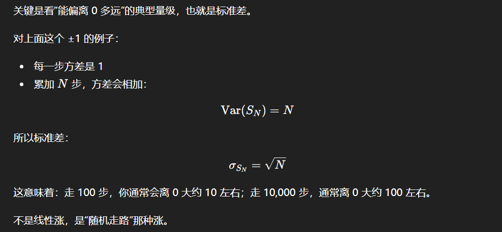

## 更直觉的说法

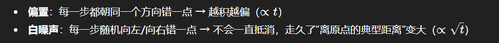

# 为什么用四元数 + 融合（Kalman 最常见）

作者回顾：多数姿态估计系统用四元数而不是欧拉角，因为四元数更灵活、没有奇异点（万向节锁）、也更利于线性化；需要时也容易转成旋转矩阵或欧拉角序列。为了抑制陀螺漂移，文献普遍使用传感器融合，其中 Kalman 滤波最常见。

# 相关工作对比（EKF/UKF、磁罗盘、简化思路）

作者列出典型路线：

有工作用 EKF，把状态里放“四元数 + 角速度 + 陀螺漂移”，能很好修正 roll/pitch，但 yaw 修正较弱；要 yaw 全修正通常需要磁罗盘。

也有工作用 9D（磁 + 角速率 + 重力）传感器做全姿态；为了简化 KF，先用额外算法（如 Gauss–Newton、QUEST）估计四元数，使后续可用线性 KF。

还有自适应增益 KF：在高加速度或静止状态下调整校正强度。

有人用 UKF 认为更准且实现成本低；但也有对比指出 EKF 与 UKF 精度相近，而 UKF 计算量明显更大。

# 本文定位与贡献（单封装目标 + 两阶段滤波的工程动机）

作者指出：上述多数方案是“分立传感器 + MCU/PC 跑算法”。本文目标是把系统做得更“单封装”：基于 SensorDynamics 的 SD746 6D IMU 原型（陀螺+加速度计），实现一套主要依赖 6D 的姿态估计系统，并可选外接磁罗盘。

核心算法是两阶段滤波：

* 可开关第二阶段（磁罗盘校正），带来更强的运行灵活性；

* 仅用加速度计能稳定估计 roll/pitch；加上磁罗盘才能把 yaw 也校正好；

* 两阶段拆分后矩阵更小、算力需求更低；

* 遇到磁异常时，影响被“隔离”到 yaw，roll/pitch 不会被磁干扰污染。

最后，作者给出硬件目标：把姿态估计系统集成进控制陀螺+加速度计的 ASIC，磁罗盘可通过 I²C 两线接口外接；并给出面积约束 0.5 mm²。

## 和EKF的区别

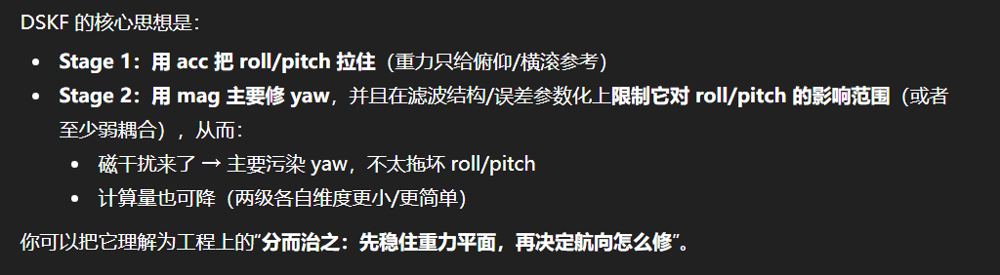

* EKF：一个滤波器里同时估计姿态/偏置，acc/mag 都是观测；就算按顺序更新，它们仍在同一 𝑃里耦合，mag 可能影响 roll/pitch。

* DSKF：明确分两级：先用 acc 稳 roll/pitch，再用 mag 主要修 yaw，并尽量隔离磁异常对 roll/pitch 的影响。

# Kalman 框架：离散状态方程（从式 (1) 开始）

KF 的离散预测形式（式 (1)）

按照 KF 理论，需要定义离散时间的状态演化：由上一时刻状态$x_{k-1}$通过状态转移矩阵$A_k$演化，并可叠加输入$u_k$通过$B_k$进入系统。论文给出预测（a priori）形式：

$$
\hat{x_k}^- = A_k\hat{x_{k-1}} + B_ku_k \quad (1)
$$

这里：
* $^-$上标表示**先验/预测值**
* $\hat{}$表示真实状态未知、滤波器提供的是估计

#  为什么状态只选四元数（不把 bias 等扩维）

作者明确：状态方程里只用表示姿态的四元数做系统状态。加入更多变量（如角速度、漂移）并不会显著提高姿态精度，但会显著增加矩阵规模与计算量；加入 extra state 可能用于建模陀螺 bias，但仿真显示精度提升 小于 1°，不值当。

# 姿态表示：四元数与欧拉角

## 四元数定义

姿态用四元数表示：

$$
q = [q_0, q_1, q_2, q_3]^T
$$

其中$q_0$是实部，$[q_1, q_2, q_3]^T$是向量部${v}$。

## 轴角与四元数关系

绕单位旋转轴${v}$旋转角$\alpha$的旋转可用:
$$
q = cos(\alpha / 2) + sin(\alpha / 2){v} \quad(3)
$$

向量部给出旋转轴方向，实部对应旋转角信息

### 正确的维度展开写法

四元数通常写成：
$$
q = \begin{bmatrix} q_0 \\ q_v \end{bmatrix} = \begin{bmatrix} q_w \\ q_x \\ q_y \\ q_z \end{bmatrix}
$$

其中：
* ${q_0}$ = ${q_w}$是标量部
* ${q_v}$ = $\begin{bmatrix}q_x, q_y, q_z\end{bmatrix}^T$是向量部(3 $\times$ 1)

## 单位四元数约束与范数

要正确表示旋转，四元数必须是单位范数。范数：

$$
|q| = \sqrt{q_0^2 + q_1^2 + q_2^2 + q_3^2} \quad(4)
$$

（工程实现里通常每次更新后要做归一化以抑制数值漂移。）

## 四元数到欧拉角

文中选用 XYZ 欧拉角序列，并给出 roll $\phi$\pitch $\theta$、yaw $\psi$ 的标准转换：

# 连续时间状态方程：四元数运动学

## 四元数微分方程
系统的连续时间状态方程写为：
$$
\dot{q}_n^b = \frac{1}{2}\Omega^n_{nb}q^b_n
$$

## $\Omega$的具体形式与陀螺角速度进入方式

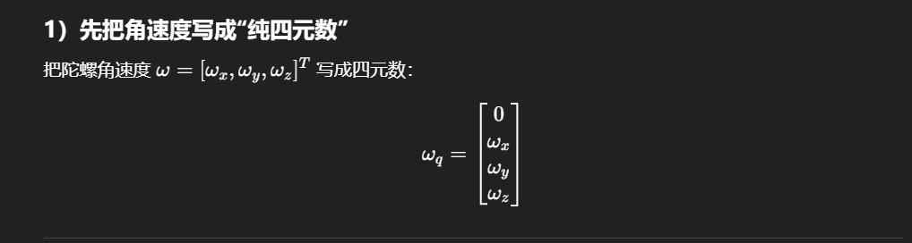

## $\dot{q}_n^b = \frac{1}{2}\Omega^n_{nb}q^b_n$连续系统把导数展开

$$
\dot{q}_n^b = \lim_{T \to 0}\frac{q_n^b(t + T) - q_n^b(t)}{T} = A_{TC}q_n^b(t)
$$

如果把它写成线性时变系统

$$
\dot{q}(t) = A(t)q(t), 其中A(t) = \frac{1}{2}\Omega(w(t))
$$

其中$A_{TC} = \frac{1}{2}\Omega^n_{nb}$

# 用离散步长T得到离散更新

把数字系统里的固定采样周期T代入，得到：

$$
q_{bn}(t+T) = q_{bn}(t) + A_{TC}q_{bn}(t)T = (I + A_{TC}T)q_{bn}(t)
$$

# 离散状态转移矩阵$A_k$

因此离散矩阵为：
$$
A_k = (I + A_{TC}T) = (I + \frac{1}{2}\Omega^n_{nb}T)
$$

# 归一化说明

状态方程不会保持四元数范数。而姿态只能由单位四元数正确表示，所以要加一个归一化单元保证数据正确性。

就是每次预测或更新后做：
$$
q \leftarrow \frac{q}{\|q\|}
$$

# 从预测进入校正

* 第一阶段：用加速度计

* 第二阶段：用磁罗盘

## 标准校正方程与残差residual定义

$$
\hat{x_k} = \hat{x_k}^- + K_k(z_k - H\hat{x_k}^-)
$$

* $z_k$是实际测量（这里就是加速度计或者磁罗盘）
* $H\hat{x_k}^-$是先验状态对应的“期望测量”
* 二者的差值叫做残差residual，残差乘以$K_k$得到校正因子，从而得到后验估计$\hat{x_k}$（概率意义下的最小二乘解）

## 先验协方差

为了计算卡尔曼增益，先要算先验误差协方差$P_k^-$
$$
P_k^- = A_kP_{k-1}A^T_k + Q_k
$$

## 卡尔曼增益

$$
K_k = P^-_kH^T_k(H_kP^-_kH^T_k + V_kR_kV_k^T)^{-1}
$$

## 后验协方差

$$
P_k = (I - K_kH_k)P^-_k
$$

# Stage1：用加速度计修正roll/pitch

用当前的“先验姿态四元数”去预测重力方向（期望测量），再用加速度计实测减掉期望测量得到残差；残差乘 Kalman 增益得到一个“小的修正四元数增量” $q_{e1}$；为了不让加速度计把 yaw 搅乱，把$q_{e1}$的 yaw 对应分量置零。

## Step0：准备输入

* 先验姿态四元数（用陀螺积分得到）
$$
\hat{q}_k^- = \begin{bmatrix}q_0,q_1,q_2,q_3\end{bmatrix}^T
$$

* 加速度计测量:
$$
z_{k1} = \begin{bmatrix}a_x, a_y, a_z\end{bmatrix}^T
$$

关键点：加速度计测的是$g + a_{lin}$。为了把它当“重力方向”用，要归一化（并在动态大时降权/弃用）：

$$
\~{z} = \frac{z_{k1}}{\|z_{k1}\|}
$$

## Step1: 用四元数预测“期望重力方向”$h_1(\^q)$

“把导航系重力$\begin{bmatrix}0,0,1\end{bmatrix}$”旋到 body 系后的方向（单位向量形式）：
$$
h_1(\^q) = \begin{bmatrix}2q_1q_3 - 2q_0q_2 \\ 2q_0q_1 + 2q_2q_3 \\ q_0^2 - q_1^2 -q_2^2 + q_3^2\end{bmatrix}
$$
它输出是 3×1，和归一化后的加速度计方向同维度。

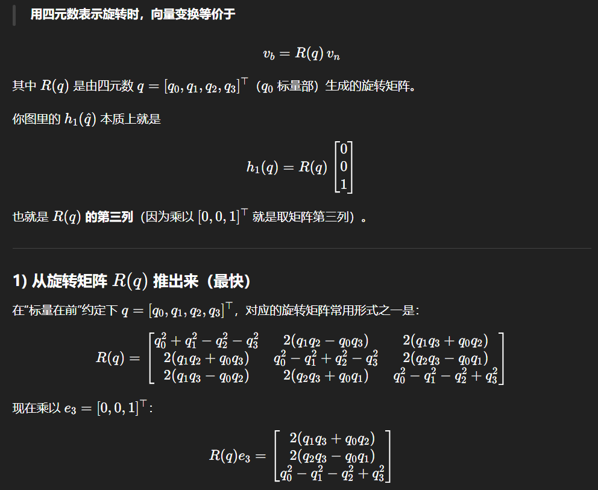

## Step2: 算残差

$$
r = \~z - h_1(\hat{q}_k^-)
$$

这个式子代表：**测到的重力方向减去姿态预测的重力方向**

## Step3：算雅可比$H_{k1} = \frac{\partial{h_1}}{\partial{q}}\quad(3 \times 4)$

对上面的$h_1$分量逐项求导，得到：

第一行$h_x = 2q_1q_3 - 2q_0q_2$

$$
\frac{\partial{h_x}}{\partial\begin{bmatrix}q_0,q_1,q_2,q_3\end{bmatrix}} = \begin{bmatrix}-2q_2, 2q_3, -2q_0, 2q_1\end{bmatrix}
$$

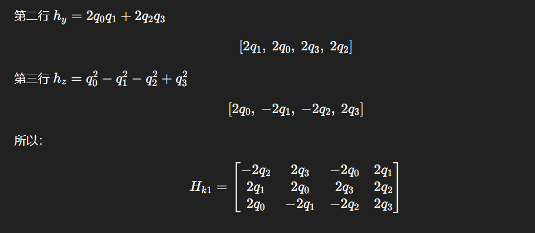

## Step4: 算创新协方差S和卡尔曼增益K

$$
S = H_{k1}P_k^-H_{k1}^T + R_{k1}
K = P_k^-H_{k1}^TS^{-1}
$$

* $P_k^-$: 四元数状态协方差
* $R_{k1}$: 加速度计观测噪声协方差，**动态越大应设越大**，降低加速度校正力度

## Step5: 更新四元数并归一化
标准KF更新：
$$
\^q_k = \^q_k^- + Kr
$$

### 先算四元数增量
$$
q_{e1} = Kr
$$

### 隔离yaw
$$
(q_{e1})_3 \leftarrow 0
$$

### 更新四元数
$$
\hat{q}_k = \hat{q}_k^- + q_{e1}
$$

归一化：
$$
\^q_k \leftarrow \frac{\^q_k}{\|\^q_k\|}
$$
协方差更新：
$$
P_k = (I - KH_{k1})P^-_k
$$

# Stage2: 用磁力计修正yaw

## Step0: 输入(Stage1更新后的结果)

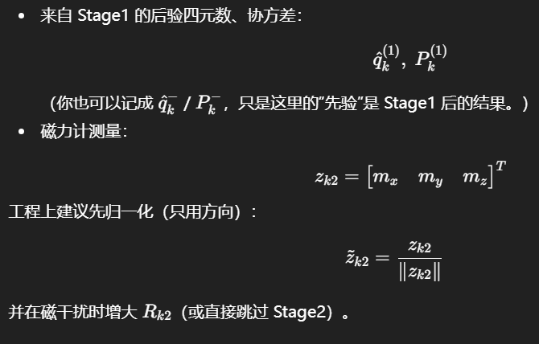

## Step1: 期望磁场（由先验四元数预测）

## Step2：残差

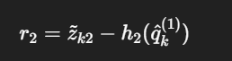

## Step3：测量雅可比$H_{k2}$

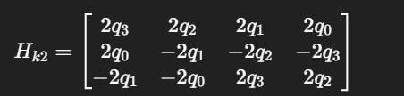

这里的$q_i$用的当前用于Stage2的先验$\^q_k^{(1)}$里的分量。

## Step4：创新协方差与卡尔曼增益

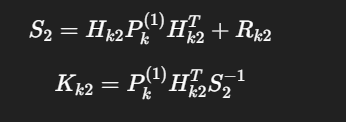

## Step5：算修正量，并隔离roll/pitch,只保留yaw

然后做隔离：把 roll/pitch 对应的分量置零，只保留 yaw 对应那一维。

## Step6：更新四元数、归一化、更新协方差

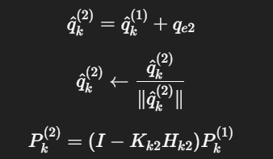

# 面向硬件实现的算法简化

为了实现面积占用低、功耗低的集成系统，作者对第二节给出的 KF 算法做了简化；目标是在一个简化的算术逻辑单元（ALU）上运行，该 ALU 只能做乘法与加法。

## 简化1：用$P_k$近似$P_k^-$ （把预测协方差更新拿掉）

标准KF有：
* 先验协方差（预测后）：$P_k^-$
* 后验协方差（更新后）：$P_k$

这里假定：
$$
P_k^- \approx P_k
$$

直觉解释：
如果采样很快、每次更新很小，那么“预测一步”并不会让不确定度涨很多——于是把$P_k^-$当成上一轮更新后的$P_k$用，误差不大。

等价于：不再做$P^- = APA^T + Q$这步，直接用一个“当前的 
𝑃参与后面的增益计算。

## 简化2：$P_k$离线预设 + 启动阶段阶跃（前128次）

## 简化3：消除除法

## 简化4：去掉四元数归一化

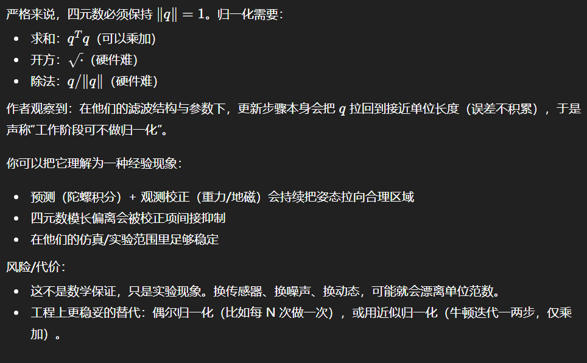