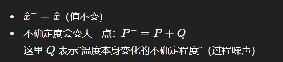
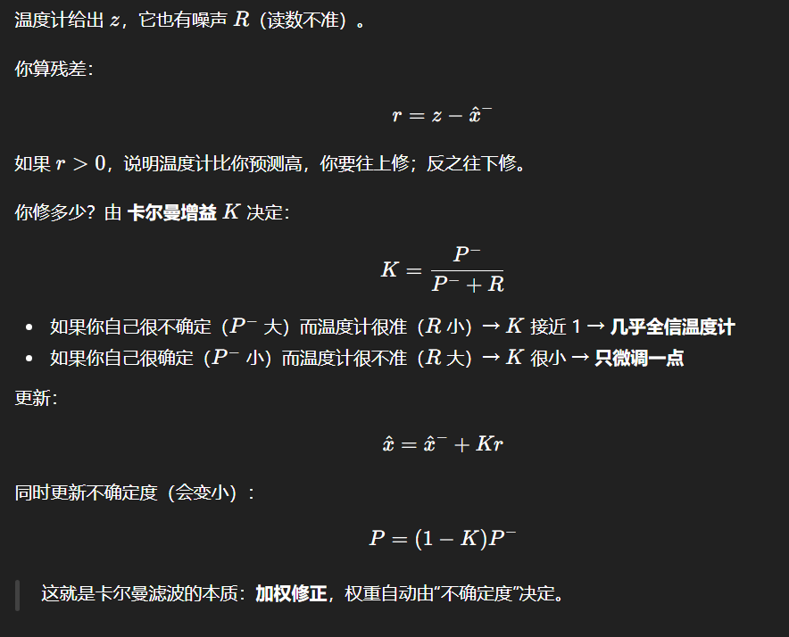
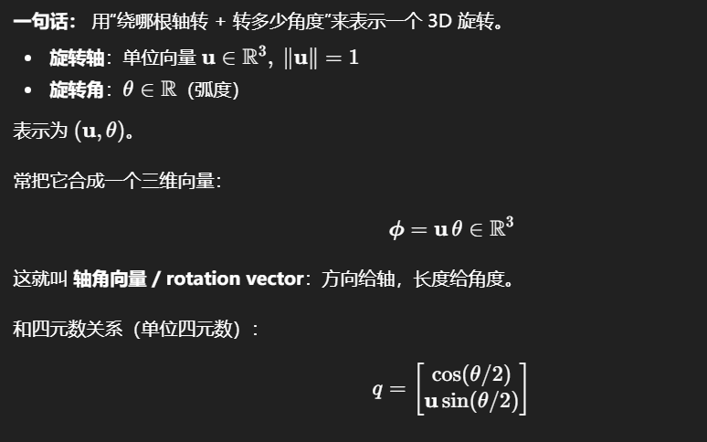
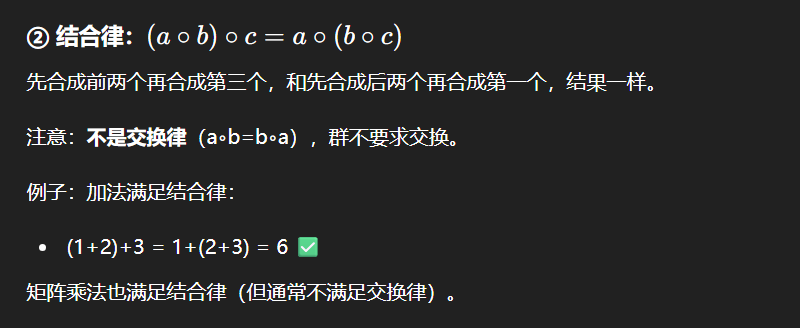
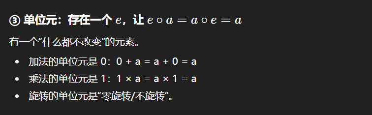
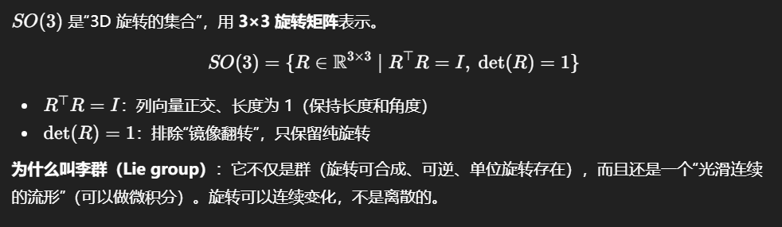
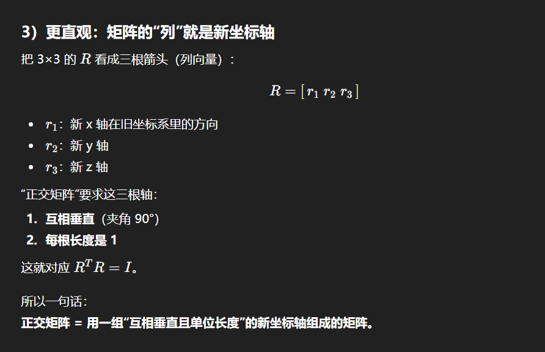
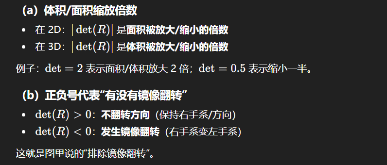
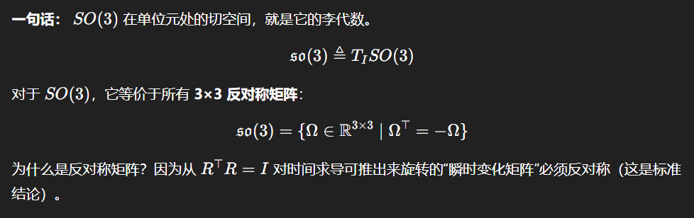
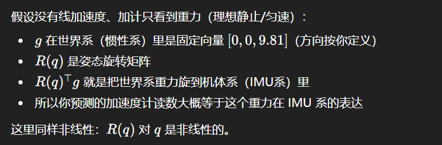

# EKF 的一句话版本

EKF 就是在循环做两件事：

* 预测：用模型把状态往前推一步（我猜现在是什么）

* 纠正：用传感器观测把这个猜测拉回来一点（我修正一下）

> 区别于普通“直接平均”：EKF 会同时维护一个东西叫 不确定度，用它来决定“信模型多一点还是信观测多一点”。

# 用最小例子讲：估计“房间温度”

你想知道真实温度 𝑥, 但你只有一个温度计读数 𝑧，它有噪声。

## 1.1 你手里维护两样东西

* $\hat{x}$：你当前认为的温度（比如 25.0℃）

* $P$：你对这个温度的“不确定度”（比如“我可能错个 1℃”）

## 1.2 每来一次新读数，你做一次循环

### A) 预测（模型）

如果你认为温度变化很慢，可以用简单模型：

$x_k = x_{k-1} + \omega$

意思：下一秒温度≈上一秒温度，但会有一点随机变化$\omega$ 

于是你预测：

* 过程噪声

### B) 纠正（用温度计读数）

> 温度计读数 - 预测值 = 残差

* $P^-$: 更新前（只做了预测/时间推进后的）不确定度
* $P$: 更新后（融合了量测后的）不确定度
* $K$: 卡尔曼增益（0~1之间的权重，标量情况下）

不确定度用协方差 𝑃表示。你可以把它当成“我对自己估计值有多没把握”。

预测阶段：你只靠模型推，误差会被过程噪声推大，所以得到$P^-$（通常变大）。

更新阶段：你引入了一次观测（传感器量测），等于多了一条信息约束，信息变多 → 不确定度下降，所以得到 𝑃（会变小）。

在标量情况下，0≤K≤1（在正常噪声设定下），所以：

$(1-K) <= 1 \Rightarrow P <= P^- $

直观理解：

𝐾大：更信量测 → 修正更猛 → 不确定度降得更多

𝐾小：更信预测 → 修正很弱 → 不确定度几乎不变

# EKF扩展在哪里？
上面例子里模型是线性的（加法）。

但 IMU/姿态里模型是非线性的，比如：

这时你仍然想做同样的两步：预测 + 纠正。
问题是：**不确定度**𝑃怎么传播？
线性时用$FPF^T$，非线性时 EKF 就用在**当前点附近的局部线性化**来得到一个近似的 𝐹（雅可比）。

所以 EKF = “卡尔曼滤波 + 用雅可比做局部线性化”。
## 四元数更新$q_k = q_{k-1} \otimes exp(\frac{1}{2}\omega\Delta{t})$是啥意思

### 为什么是$\delta{q} \approx exp(\frac{1}{2}\omega\Delta{t})$
#### 轴角形式

#### 群（group）与“群元素”
你可以把“群”理解成：

有一堆东西（集合），你规定一个“把两个东西合成一个东西”的操作（比如加法、乘法、矩阵相乘、旋转叠加），
只要这操作满足 4 个条件，这套系统就叫群。

图里写的“∘”（小圆圈）就是“这个合成运算”的占位符。
它不一定是乘法，也不一定是加法——你怎么定义都行，只要满足下面 4 条。

#### 旋转李群$SO(3)$

##### 怎么理解正交矩阵
正交矩阵就是“不拉伸、不压扁、不剪切”的线性变换矩阵——只会把坐标轴转一下（或者再加个镜像翻转）。

##### 怎么理解行列式
行列式在几何上代表体积/面积缩放倍数，正负号代表有没有镜像反转

正交矩阵不改变长度和角度，所以也不改变面积/体积的大小，det只能是±1

#### 切空间

#### 李代数

切空间/李代数 = “在某个姿态附近，用 3 个数表示的微小旋转（增量）的线性世界”。

## 重力投影：$a \approx R(q)^Tg$是啥意思

### 为什么$R(q)对q非线性$

## 不确定度P怎么传播

**变换会放大/旋转误差** + **每一步又会新增噪声**
* 你把一个带误差的量“变换/积分”到下一步时，旧误差会被当前的变换关系 传播（甚至被放大、耦合）；
* 每一步传感器都会产生新的随机误差（噪声），所以每一步都要 再加一坨新噪声。

* 奇异值就是矩阵对某个方向“拉伸/压缩”的倍数

