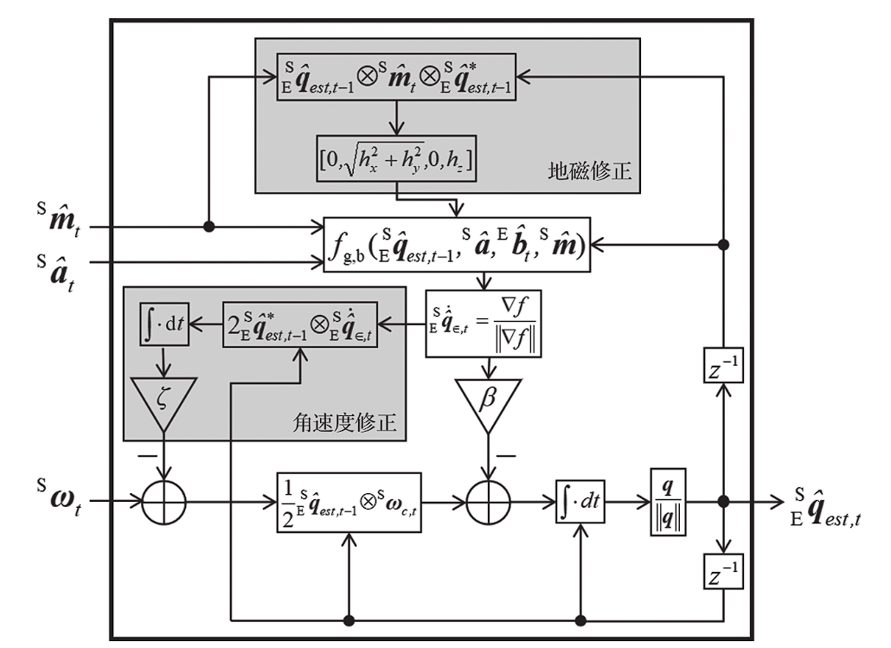

## Madgwick

首先利用传感器的角速度信息 ${}^S\omega$ 推算姿态。以前一时刻航姿估计 ${}^{S}_{E}\hat{q}_{est,t-1}$ 和角速度 ${}^S\omega_t$ 为输入，满足式（4-73）的微分方程；再用离散积分得到当前时刻由角速度推算的航姿 ${}^{S}_{E}q_{\omega,t}$，如式（4-74）。

$$
{}^{S}_{E}\dot{q}_{\omega,t}
=
\frac{1}{2}\;{}^{S}_{E}\hat{q}_{est,t-1}\;\otimes\;{}^{S}\omega_t
\qquad (4\text{-}73)
$$

$$
{}^{S}_{E}q_{\omega,t}
=
{}^{S}_{E}\hat{q}_{est,t-1}
+
{}^{S}_{E}\dot{q}_{\omega,t}\,\Delta t
\qquad (4\text{-}74)
$$

### 1) 变量都代表什么

- ${}^{S}_{E}\hat{q}_{est,t-1}$：上一时刻估计的姿态四元数（表示坐标系 $E \rightarrow S$ 的旋转；不同资料可能写成 $S \rightarrow E$，注意定义一致性）。
- ${}^S\omega_t=[\omega_x,\omega_y,\omega_z]$：陀螺仪在时刻 $t$ 测得的角速度向量（单位 rad/s）。
- ${}^{S}\omega_t=[0,\omega_x,\omega_y,\omega_z]$：把角速度“塞进四元数”的**纯虚四元数**（实部为 0）。
- $\otimes$：四元数乘法（Hamilton product）。
- $\Delta t$：采样周期/时间间隔。

> 注意：有的资料会写成 ${}^{S}_{E}\dot{q}=\tfrac{1}{2}\,{}^{S}\omega\otimes{}^{S}_{E}q$，或者 ${}^{S}_{E}\dot{q}=\tfrac{1}{2}\,{}^{S}_{E}q\otimes{}^{S}\omega$。  
> 这取决于你用的是“左乘/右乘”的姿态定义（以及角速度在哪个坐标系表达）。**只要全篇一致即可**。

### 2) 式（4-74）的意义：离散积分（欧拉法）

式（4-74）就是用欧拉法对式（4-73）做离散积分：

1. 先用（4-73）算出当前的四元数变化率 ${}^{S}_{E}\dot{q}_{\omega,t}$；
2. 再乘以 $\Delta t$ 做一步更新，得到 ${}^{S}_{E}q_{\omega,t}$。

工程里通常每步还会做一次归一化以抑制数值漂移：

$$
q_t \leftarrow \frac{q_t}{\|q_t\|}
$$

通过加速度和磁力信息，同样可以计算出航姿 ${}^{S}_{E}\hat{q}$。归一化的重力加速度 ${}^{E}\hat{g}=[0,0,0,1]$，
通过 ${}^{S}_{E}\hat{q}$ 投影后就是加速度计测量值 ${}^{S}\hat{a}=[0,a_x,a_y,a_z]$。同样，归一化的地磁 ${}^{E}\hat{b}=[0,b_x,0,b_z]$，
通过 ${}^{S}_{E}\hat{q}$ 投影后就是磁力计测量值 ${}^{S}\hat{m}=[0,m_x,m_y,m_z]$。
由于引入了归一化，因此不能直接通过投影关系求解航姿，但是可以利用投影关系来构建优化问题，
以代价函数的方式来求解航姿。归一化的重力加速度约束代价函数如式（4-75）所示，
归一化的地磁约束代价函数如式（4-76）所示。

$$
f_g\!\left({}^{S}_{E}\hat{q},\,{}^{S}\hat{a}\right)
=
{}^{S}_{E}\hat{q}^{*}\otimes{}^{E}\hat{g}\otimes{}^{S}_{E}\hat{q}
-
{}^{S}\hat{a}
\qquad (4\text{-}75)
$$

$$
f_b\!\left({}^{S}_{E}\hat{q},\,{}^{E}\hat{b},\,{}^{S}\hat{m}\right)
=
{}^{S}_{E}\hat{q}^{*}\otimes{}^{E}\hat{b}\otimes{}^{S}_{E}\hat{q}
-
{}^{S}\hat{m}
\qquad (4\text{-}76)
$$

这段话中两个式子（4-75）–（4-76）的核心是：用“姿态 $q$”把已知的世界向量（重力/地磁）旋到传感器坐标系，
得到“预测的传感器读数”，再与真实传感器读数做差，这个差就是约束残差（代价函数）。

将两个约束放在一起，构建一个完整的代价函数，如式（4-77）所示：

$$
f_{g,b}\!\left({}^{S}_{E}\hat{q},\,{}^{S}\hat{a},\,{}^{E}\hat{b},\,{}^{S}\hat{m}\right)
=
\begin{bmatrix}
f_g\!\left({}^{S}_{E}\hat{q},\,{}^{S}\hat{a}\right)\\[4pt]
f_b\!\left({}^{S}_{E}\hat{q},\,{}^{E}\hat{b},\,{}^{S}\hat{m}\right)
\end{bmatrix}
\qquad (4\text{-}77)
$$

通过最小化式（4-77）可以求解航姿。梯度下降法是一种求代价函数最小值的常用优化方法。
沿着梯度的反方向，能够迅速使代价函数的值下降，如式（4-78）所示：

$$
{}^{S}_{E}\hat{q}_{k+1}
=
{}^{S}_{E}\hat{q}_{k}
-
\mu\,\frac{\nabla f}{\left\|\nabla f\right\|}
,\quad k=0,1,2,\cdots,n;
\qquad
\nabla f = J^{T}f
\qquad (4\text{-}78)
$$

### （4-78）梯度下降在干嘛？

目标：让残差尽量小。把“预测的重力/地磁方向”和“传感器实测方向”的不一致当作残差，然后通过迭代更新四元数姿态 $q$，让这个不一致越来越小。

---

#### 1) 变量都是什么

- $q_k$：第 $k$ 次迭代的姿态四元数（当前姿态“猜测”）。
- $f$：残差（误差）向量，来自前面的两条约束：
  - 重力残差：$f_g(q)=\hat{g}^{S}(q)-\hat{a}$
  - 地磁残差：$f_b(q)=\hat{b}^{S}(q)-\hat{m}$
- 把它们堆叠起来（stacking residuals）：
  $$
  f(q)=
  \begin{bmatrix}
  f_g(q)\\
  f_b(q)
  \end{bmatrix}
  $$

直观上：如果姿态对了，则预测与实测一致，$f(q)\approx 0$。

---

#### 2) 最小二乘目标：让 $\|f(q)\|^2$ 最小

常用的代价函数（最小二乘）：

$$
\min_{q}\ \|f(q)\|^2
$$

（有时也写成 $F(q)=\frac{1}{2}\|f(q)\|^2$，多一个 $\frac{1}{2}$ 只是为了求导更方便。）

---

#### 3) 为什么梯度是 $\nabla F = J^T f$

定义雅可比矩阵：

$$
J=\frac{\partial f}{\partial q}
$$

其中 $f$ 是 $m$ 维、$q$ 是 4 维（四元数分量），所以 $J\in\mathbb{R}^{m\times 4}$。

令

$$
F(q)=\frac{1}{2}\|f(q)\|^2=\frac{1}{2}\,f(q)^T f(q)
$$

对 $q$ 求梯度（链式法则）得到：

$$
\nabla F
=
\frac{\partial F}{\partial q}
=
J^T f
$$

这就是图里写的 $\nabla f = J^T f$（更严谨地说应是 $\nabla F = J^T f$，即对标量代价 $F$ 的梯度）。

---

#### 4) 梯度下降更新式（4-78）表达了什么

沿着梯度的反方向更新（因为梯度指向“上升最快”的方向，取负号就是“下降最快”）：

$$
q_{k+1}=q_k-\mu\,\frac{\nabla F}{\|\nabla F\|}
,\qquad 
\nabla F=J^T f
\qquad (4\text{-}78)
$$

- $\mu$：步长（学习率）。
- $\frac{\nabla F}{\|\nabla F\|}$：把梯度方向单位化，只保留方向，不让梯度大小直接把步长“放大/缩小”，更稳。

工程上通常每步还会做一次归一化，保持单位四元数约束：

$$
q_{k+1}\leftarrow \frac{q_{k+1}}{\|q_{k+1}\|}
$$

---

#### 5) 一句话理解

你有一个姿态猜测 $q_k$，它导致“预测的重力/地磁方向”与“实测方向”不一致；  
梯度下降就是计算“往哪个方向改 $q$ 能让不一致下降得最快”，然后走一步，反复迭代直到误差足够小。

通常式（4-78）需要经过多步梯度下降处理才能达到期望值，显然这会消耗大量计算资源。我们可以通过设置合适的步长，用一步梯度下降处理就达到期望值，如式（4-79）所示。

$$
{}^{S}_{E}q_{\nabla,t}
=
{}^{S}_{E}\hat{q}_{est,t-1}
-
\mu_t\,\frac{\nabla f}{\left\|\nabla f\right\|}
,\qquad
\mu_t=\alpha\,\left\|{}^{S}_{E}\dot{q}_{\omega,t}\right\|\Delta t,
\ \alpha>1
\qquad (4\text{-}79)
$$

---

### 1）那 $\mu_t=\alpha\|{}^{S}_{E}\dot{q}_{\omega,t}\|\Delta t$ 为啥这么取？

这里 ${}^{S}_{E}\dot{q}_{\omega,t}$ 是陀螺带来的姿态变化率（四元数微分）。由（4-73）：

$$
{}^{S}_{E}\dot{q}_{\omega,t}
=
\frac{1}{2}\;{}^{S}_{E}\hat{q}_{est,t-1}\otimes{}^{S}\omega_t
\qquad (4\text{-}73)
$$

因此 $\|{}^{S}_{E}\dot{q}_{\omega,t}\|\Delta t$ 可以理解为“这一采样周期内，陀螺积分会让姿态变化的量级”。  
把 $\mu_t$ 设成与它同量级（再乘一个经验放大系数 $\alpha$），相当于让“一步梯度下降”的修正幅度与陀螺导致的姿态变化幅度可比，从而更快收敛。

---

利用加权平均，将从角速度推算出来的航姿 ${}^{S}_{E}q_{\omega,t}$ 和从加速度计、磁力计推算出来的航姿 ${}^{S}_{E}q_{\nabla,t}$ 进行融合，如式（4-80）所示：

$$
{}^{S}_{E}\hat{q}_{est,t}
=
\gamma_t\,{}^{S}_{E}q_{\nabla,t}
+
(1-\gamma_t)\,{}^{S}_{E}q_{\omega,t}
,\qquad 0\le\gamma_t\le 1
\qquad (4\text{-}80)
$$

---

### 2）由角速度计算出的航姿误差可以用 $\beta\Delta t$ 衡量

陀螺在单位时间内的零偏噪声/漂移强度可以转化为“姿态每秒会漂多少”，用参数 $\beta$ 表示，如式（4-81）：

$$
\beta
=
\left\|
\frac{1}{2}\,\hat{q}\otimes[0,\tilde{\omega}_{\beta},\tilde{\omega}_{\beta},\tilde{\omega}_{\beta}]
\right\|
=
\sqrt{\frac{3}{4}}\;\tilde{\omega}_{\beta}
\qquad (4\text{-}81)
$$

其中 $\tilde{\omega}_{\beta}$ 可理解为陀螺“单位时间的等效漂移量级”（常用单位 rad/s）。

---

### 3）式（4-81）为什么右边变成 $\sqrt{3/4}\,\tilde{\omega}_{\beta}$？

关键用到两点：

- 单位四元数不改变模长：$\|\hat{q}\otimes v\|=\|v\|$（$\hat{q}$ 为单位四元数）。
- 纯虚四元数 $[0,a,b,c]$ 的模长是 $\sqrt{a^2+b^2+c^2}$。

因此：

$$
\left\|
\frac{1}{2}\,\hat{q}\otimes[0,\tilde{\omega}_{\beta},\tilde{\omega}_{\beta},\tilde{\omega}_{\beta}]
\right\|
=
\frac{1}{2}\left\|[0,\tilde{\omega}_{\beta},\tilde{\omega}_{\beta},\tilde{\omega}_{\beta}]\right\|
=
\frac{1}{2}\sqrt{3\tilde{\omega}_{\beta}^2}
=
\sqrt{\frac{3}{4}}\;\tilde{\omega}_{\beta}.
$$

---

### 4）用误差比值给出 $\gamma_t$ 的原则

文中给出误差占比关系（4-82）来确定融合系数：

$$
\frac{\beta\Delta t}{\mu_t}
=
\frac{\gamma_t}{1-\gamma_t}
\qquad (4\text{-}82)
$$

由此解出：

$$
\gamma_t
=
\frac{\beta}{\frac{\mu_t}{\Delta t}+\beta}
\approx
\frac{\beta\Delta t}{\mu_t}
\qquad (4\text{-}83)
$$

（当 $\beta\Delta t\ll\mu_t$ 时，近似成立，所以常见结论是 $\gamma_t\approx 0$，即更信任陀螺传播，梯度项作为小校正。）

---

将式（4-83）、式（4-79）和式（4-74）的结论代入式（4-80），可得到式（4-84）：

$$
{}^{S}_{E}\hat{q}_{est,t}
=
\gamma_t\left(
{}^{S}_{E}\hat{q}_{est,t-1}
-\mu_t\frac{\nabla f}{\|\nabla f\|}
\right)
+
(1-\gamma_t)\left(
{}^{S}_{E}\hat{q}_{est,t-1}
+{}^{S}_{E}\dot{q}_{\omega,t}\Delta t
\right)
\qquad (4\text{-}84)
$$

为了计算方便，将式（4-84）整理成下面三个式子（4-85）、（4-86）和（4-87）：

$$
{}^{S}_{E}\dot{q}_{\varepsilon,t}
=
\frac{\nabla f}{\|\nabla f\|}
\qquad (4\text{-}85)
$$

$$
{}^{S}_{E}q_{est,t}
=
{}^{S}_{E}q_{\omega,t}
-
\beta\Delta t\,{}^{S}_{E}\dot{q}_{\varepsilon,t}
\qquad (4\text{-}86)
$$

$$
{}^{S}_{E}q_{\omega,t}
=
{}^{S}_{E}\hat{q}_{est,t-1}
+
{}^{S}_{E}\dot{q}_{\omega,t}\Delta t
\qquad (4\text{-}87)
$$

### 1）他们先写一个“融合式”：把两种结果加权平均

图里第一行（4-84）最上面这一句：

$$
q_{est,t}=\gamma_t\,q_{\nabla,t}+(1-\gamma_t)\,q_{\omega,t}
$$

意思：

- $q_{\omega,t}$：只用陀螺积分得到的姿态（会漂）
- $q_{\nabla,t}$：只用梯度下降（重力/地磁约束）得到的“校正后姿态”（更对齐观测）
- $\gamma_t$：权重，表示“更信任校正还是更信任陀螺”

这一步就是“思想”：把两条路的结果融合。

---

### 3）关键简化：选取 $\gamma_t=0$

你图里出现了这一行：

$$
=0\cdot q_{est,t-1}-\gamma_t\mu_t\frac{\nabla f}{\|\nabla f\|}+(1-0)(q_{est,t-1}+\dot q_{\omega,t}\Delta t)
$$

这行其实是在说明他们最终取了 $\gamma_t=0$  
（也就是不再直接做“姿态层面的加权平均”，而是让校正发生在**角速度层面**做校正）。

你会看到最后局部变成：

$$
q_{est,t}=q_{est,t-1}+\dot q_{\omega,t}\Delta t-\beta\Delta t\frac{\nabla f}{\|\nabla f\|}
$$

这里把 $\gamma_t\mu_t$ 重命名成 $\beta\Delta t$（用误差上界合并掉），目的就是把形式改写成 Madgwick 的“gyro 项 + correction 项”。

直觉：最终不再把“两条姿态结果做平均”，而是把纠正项看成一个“额外角速度/姿态变化率”，直接加到 $\dot q$ 里。

---

### 4）为了计算方便，把（4-84）拆成三步实现（4-85）（4-86）（4-87）

这三行就是工程代码里最常见的三步：

#### （4-85）先算单位梯度方向（误差方向）

$$
\dot q_{\varepsilon,t}=\frac{\nabla f}{\|\nabla f\|}
$$

意义：只要方向，不要幅值。

#### （4-86）用它去修正“角速度驱动的四元数导数”

$$
\dot q_{est,t}=\dot q_{\omega,t}-\beta\,\dot q_{\varepsilon,t}
$$

意义：

- $\dot q_{\omega,t}$：陀螺给你的“姿态变化率”
- $-\beta\,\dot q_{\varepsilon,t}$：用加计/磁计推出的“纠偏变化率”
- 两者相加得到最终的姿态变化率

#### （4-87）积分得到姿态

$$
q_{est,t}=q_{est,t-1}+\dot q_{est,t}\Delta t
$$

然后通常还会做一次归一化：

$$
q\leftarrow \frac{q}{\|q\|}
$$

---

## Madgwick 把“加计/磁计纠偏”当成一股“虚拟角速度”，去抵消陀螺的漂移

所以最终的四元数导数 = 陀螺造成的转动率 − 纠偏造成的转动率。

---

### 1）$\dot q_{\omega,t}$：陀螺给你的“姿态变化率”

陀螺测的是角速度 $\omega$（rad/s）。  
角速度换成四元数的变化率（四元数导数）就是：

$$
\dot q_{\omega,t}=\frac{1}{2}\,q\otimes[0,\omega_x,\omega_y,\omega_z]
$$

直觉：陀螺说你每秒该往哪个方向转、转多快，这就是“预测”。

---

### 2）$\dot q_{\varepsilon,t}$：加计/磁计告诉你“往哪边纠偏最快”

你用加计/磁计构造残差 $f(q)$（预测重力/磁场 vs 测量），再算梯度：

$$
\nabla F = J^{T}f
$$

把它归一化得到：

$$
\dot q_{\varepsilon,t}=\frac{\nabla F}{\|\nabla F\|}
$$

直觉：

- 它只给你方向：如果我把姿态往这个方向微调，误差下降最快
- 你可以把它想成一个“纠偏方向箭头”（在四元数空间里）

注意：它不是测出来的角速度，而是从对齐重力/磁场的约束里推出来的“该怎么改姿态”的方向。

---

### 3）$\beta$：纠偏力度（把“方向”变成“每秒纠多少”）

$\dot q_{\varepsilon,t}$ 只有方向，没有量级。  
$\beta$ 给它一个量级（单位与 $\dot q$ 一致，常对应 $1/s$ 或 rad/s 量级）。

直觉：

- $\beta$ 大：更信加计/磁计，纠偏更猛，收敛快但更敏感（动态/加速度会扰动）
- $\beta$ 小：更信陀螺，纠偏更稳，但漂移修得慢

---

这段在做的是：**动态估计“参考系里的地磁向量 $\hat b$”**，用它替代原来假设固定的 $[0,b_x,0,b_z]$，从而在有磁扰/缓慢变化时让航向（yaw）更稳、更准。

你可以把它理解成：**每一帧都用上一帧的姿态，把本帧磁力计读数“搬回到地球系”，得到一个当前的地磁参考；再把它规整成 $(b_x,0,b_z)$ 的形式用于代价函数。**

---

## 1) 为什么要这么做？
原始推导里，地磁先验写成：

$$
{}^{E}\hat b=[0,b_x,0,b_z]
$$

这等价于假设：环境磁场方向在参考系里是固定的。  
但现实里：电机电流、铁磁材料、场景变化会让磁场方向/强度变，固定先验会把 yaw 拉偏。

所以作者说：**用实时估计的地磁先验替代固定值，提高精度。**

---

## 2) 式 (4-88) 在干嘛：把磁力计测量从传感器系旋回参考系
你磁力计测到的是传感器坐标系 $S$ 下的单位磁场：

$$
{}^{S}\hat m_t=[0,m_x,m_y,m_z]
$$

你有上一时刻的姿态四元数 $ {}^{S}_{E}\hat q_{est,t-1}$（从参考系到传感器系，或反之，按书的定义）。  
用四元数旋转把磁场“反投影”到参考系里：

$$
[0,h_x,h_y,h_z]
=
{}^{S}_{E}\hat q_{est,t-1}\ \otimes\ {}^{S}\hat m_t\ \otimes\ {}^{S}_{E}\hat q_{est,t-1}^*
\qquad (4\text{-}88)
$$

直觉：
- $h=(h_x,h_y,h_z)$ 就是“**当前磁场在参考系 $E$ 里的方向**”的估计。
- 用 $t-1$ 的姿态来做，是因为相邻两帧姿态差很小，用上一帧近似够用，计算更稳。

---

## 3) 式 (4-89) 在干嘛：把 $h$ 规整成 $(b_x,0,b_z)$ 的规范形式
你得到的 $h=(h_x,h_y,h_z)$ 一般会有 $y$ 分量。  
但前面推导里为了简化，把参考系绕 $z$ 轴选到让地磁落在 $x$–$z$ 平面（$b_y=0$）。

现在作者做同样的“规范化”处理：  
把水平分量的长度合并到 $x$ 轴，把 $y$ 轴清零：

$$
{}^{E}\hat b_t=
\left[0,\sqrt{h_x^2+h_y^2},\,0,\,h_z\right]
\qquad (4\text{-}89)
$$

含义：
- $\sqrt{h_x^2+h_y^2}$：磁场在水平面的投影长度（水平强度）
- $h_z$：竖直分量
- 这样就得到一个满足“$b_y=0$”形式的先验地磁，用于 (4-76) 的磁约束代价函数。

直觉一句话：  
> **把参考系的 $x$ 轴对准当前磁场的水平投影**，于是磁场在参考系里就没有 $y$ 分量了。

---

## 4) 这段最终给你什么好处？
- 把磁场当成“会慢慢变的”，每帧更新一次参考地磁方向  
- yaw 约束更贴近当前环境，减少被固定先验拉偏  
- 同时仍保持推导里的简化形式（$b_y=0$），计算量小  

---

## 5) 用最工程的说法总结（对应你实现）
每帧做：

1) $h = rotate_to_E(m_S, q_est_{t-1})$  （式 4-88）  
2) $b_E = [\sqrt{(hx^2+hy^2)}, 0, hz]$     （式 4-89）  
3) 用这个 $b_E$ 去算磁约束残差/梯度（式 4-76 $\rightarrow$ $\nabla F$）

---

# (4-90)~(4-93) 通俗解释：用“姿态纠偏”反推陀螺 bias，并把它扣掉

## 一句话总纲
这几式在做的是：  
**加计/磁计告诉你“该往哪边纠偏” → 把纠偏翻译成“角速度误差” → 用积分把长期误差记成陀螺 bias → 从陀螺角速度里减掉**，从而减小长期漂移。

---

## 先分清 3 个角速度量
- **原始陀螺角速度**：$\omega_t$（含 bias）
- **等效角速度误差**：$\omega_{e,t}$（“我这一帧需要纠回去多少角速度”）
- **bias 估计**：$\omega_{b,t}$（把长期误差积分出来得到的 $\hat b$）
- **校正后角速度**：$\omega_{c,t}$（真正拿去积分姿态的角速度）

---

## (4-90) 把“纠偏项”翻译成“角速度误差”
$$
{}^{S}\omega_{e,t}=2\;{}^{S}_{E}\hat q_{est,t-1}{}^{*}\ \otimes\ {}^{S}_{E}\hat{\dot q}_{e,t}
\qquad (4\text{-}90)
$$

直觉：
- 你前面用加计/磁计+梯度下降算出了一个纠偏量（四元数形式）${}^{S}_{E}\hat{\dot q}_{e,t}$，它的意思是：**姿态应该“往这个方向转一点”才能对齐重力/磁场**。
- 但我们要估计的是陀螺的 **角速度偏差**（三维角速度）。
- (4-90) 就是用四元数运动学的反变换把“纠偏（四元数导数）”换算成“等效角速度误差”$\omega_{e,t}$。

一句更人话的理解：
> 如果系统总需要“往右拧”才能对齐，那说明陀螺可能一直“往左多拧了”，这个“多拧的每秒多少”就是 $\omega_{e,t}$。

---

## (4-91) 积分器（I 项）：把长期不为 0 的误差“记成” bias
$$
{}^{S}\omega_{b,t}=\zeta \sum_t {}^{S}\omega_{e,t}\Delta t
\qquad (4\text{-}91)
$$

更像代码的递推写法：
$$
\omega_{b,t}=\omega_{b,t-1}+\zeta\,\omega_{e,t}\Delta t
$$

直觉：
- 如果 $\omega_{e,t}$ 只是噪声：一会儿正一会儿负，长期均值 $\approx 0$ → 积分不会持续跑飞（理想情况）。
- 如果陀螺真的有常值 bias：系统会长期朝同一方向纠偏 → $\omega_{e,t}$ 长期带同方向分量（均值不为 0） → 积分会把它累积出来。

因此 $\omega_{b,t}$ 可以看作：
> **“长期需要纠的那部分角速度”**  
把它当作陀螺 bias 估计是合理的。

> 量纲提示：$\zeta$ 是积分增益（时间尺度/学习速率），它负责把累计效果调到合适的 bias 量级。

---

## (4-92) 用估计的 bias 修正陀螺角速度
$$
{}^{S}\omega_{c,t} = {}^{S}\omega_t - {}^{S}\omega_{b,t}
\qquad (4\text{-}92)
$$

直觉：
- $\omega_t$：原始陀螺（含 bias）
- $\omega_{b,t}$：估计到的 bias
- $\omega_{c,t}$：扣掉 bias 后的角速度（更接近真实值）

然后用 $\omega_{c,t}$ 去做 (4-73)(4-74) 的姿态积分，漂移会显著减小。

闭环为什么会停：
- 当 $\omega_{b,t}\approx b$ 后，漂移被抵消 → 纠偏需求变小 → $\omega_{e,t}\to 0$ → 积分不再增长。

---

## (4-93) $\zeta$ 的选取：bias 学得多快
$$
\zeta=\sqrt{\frac{3}{4}}\,\tilde{\omega}_\zeta
\qquad (4\text{-}93)
$$

直觉：
- $\zeta$ 大：bias 学得快，但容易把线加速度/磁干扰也积进去（风险：漂/发散）。
- $\zeta$ 小：bias 学得慢，但更稳。

---

## 最重要的工程提醒（机器人里必踩）
只有在加计/磁计“可信”时，(4-91) 的积分器才应该工作，否则会把外界扰动当 bias 积进去。

常见门限/策略：
- 若 $||a||$ 明显偏离 $1g$（强线加速度/振动）→ 暂停或减小 $\zeta$（不更新 bias）。
- 若磁场幅值/倾角异常（磁干扰）→ 降低磁约束权重，必要时暂停磁相关更新/积分。

---

## 5 行“人话代码”串起来
1) 由加计/磁计得到纠偏项 ${}^{S}_{E}\hat{\dot q}_{e,t}$  
2) 用 (4-90) 得到角速度误差 $\omega_{e,t}$  
3) 用 (4-91) 积分更新 bias：$\omega_{b,t}\leftarrow \omega_{b,t-1}+\zeta\omega_{e,t}\Delta t$  
4) 用 (4-92) 修正陀螺：$\omega_{c,t}\leftarrow \omega_t-\omega_{b,t}$  
5) 用 $\omega_{c,t}$ 积分姿态

# 用人话讲：Madgwick 到底在干什么？

Madgwick 本质上是在做一件事：

> **陀螺负责“短期跟动作”（高频），加计/磁计负责“长期别漂”（低频），用一个很省算力的办法把两者揉成稳定姿态。**

它不是严格的 EKF，更像是 **“带纠偏的陀螺积分器”**（互补滤波思想的四元数版）。

---

## 1) 先用陀螺“推着走”：把角速度积分成姿态
陀螺给角速度 $\omega$，Madgwick先做最基础的姿态传播：

- 把 $\omega$ 变成四元数导数 $\dot q_\omega$
- 用欧拉积分更新姿态：$q \leftarrow q + \dot q_\omega \Delta t$

**优点**：反应快、动态准。  
**缺点**：陀螺有零偏，积分久了必漂（yaw/pitch/roll都会慢慢跑）。

---

## 2) 再用加计/磁计“拉回来”：你哪里不对，就往回拽
加计在静止/匀速时主要测到重力方向；磁计在磁环境干净时能提供 yaw 参考。

Madgwick做的是：

1. 用当前姿态 $q$ **预测**：重力/地磁在传感器坐标系里应该指向哪儿  
2. 和实际测量对比，得到误差（残差）  
3. 算梯度 $\nabla F$：告诉你 **“姿态往哪个方向微调，误差下降最快”**  
4. 得到纠偏方向：$\hat{\dot q}_e = \dfrac{\nabla F}{\|\nabla F\|}$

你可以把它想象成：
> 你现在姿态像车偏离车道，加计/磁计就是车道线；梯度告诉你“往左打还是往右打”最有效。

---

## 3) 核心：把纠偏当成“额外角速度”叠加到陀螺上
Madgwick 不直接把姿态“掰回去”，而是把纠偏当成一个“校正转动率”，和陀螺转动率合成：

$$
\dot q = \dot q_\omega - \beta\,\hat{\dot q}_e
$$

然后再积分：

$$
q \leftarrow q + \dot q\,\Delta t
$$

用人话就是：

- **陀螺说**：你该这么转（$\dot q_\omega$）
- **加计/磁计说**：你在漂，应该往相反方向纠一点（$-\beta\hat{\dot q}_e$）
- **最终**：两者合成一个“更靠谱的转动率”，拿去积分

其中 $\beta$ 是“纠偏力度旋钮”：
- $\beta$ 大：拉得狠，回正快，但更容易抖、受线加速度影响
- $\beta$ 小：拉得柔，稳，但漂移压得不够

---

## 4) 进阶：它还能顺便“学”陀螺零偏（I项）
一些推导/实现会再加一条 bias 学习：

- 把长期需要纠的那部分当作陀螺 bias
- 积分得到 $\hat b$
- 用 $\omega-\hat b$ 再去做姿态传播

用人话：
> 如果系统总在同一个方向纠偏，那多半不是噪声，是陀螺真的偏了；那就把这股“长期纠偏”记下来，当作零偏补偿。

---

## 5) 三句话记住 Madgwick
1. **用陀螺积分**得到姿态（快，但漂）  
2. **用加计/磁算误差**得到“该往哪边改”  
3. **把纠偏当成额外角速度**加到陀螺上，让姿态既跟得上动作又不会长期漂

---

## 6) 什么时候会翻车（机器人上很关键）
- 急加速/急刹车：加计不再只反映重力 → 纠偏可能拉错  
- 磁环境差（电机/钢结构/电流）：磁计会把 yaw 拉偏  

工程上常做的是：
- 动态时降低加计权重（或门限：$||a||$ 偏离 $1g$ 就减弱校正）  
- 磁异常时降低/禁用磁约束（门限：$||m||$ 异常或倾角异常）  

而不是只靠调一个 $\beta$ 硬顶。

---

到这里，Madgwick算法的整个分析就讲完了。一旦确定好系统的滤波增益系数$\beta$和$\zeta$，系统就可以对角速度、加速度和磁力的9轴数据进行融合，并输出当前融合的航姿，整个滤波过程如图4-33所示。

# 这张图是什么意思？——“带地磁修正 + 带陀螺零偏估计”的 Madgwick 流程图

这张图把 **Madgwick（四元数互补滤波）**画成了一个信号流程图，并且加了两块增强：
1) **地磁参考自适应（地磁修正）**  
2) **陀螺 bias 在线估计（角速度修正，I 项）**

---

## 0) 输入/输出（看懂信号）
**输入：**
- ${}^{S}\hat m_t$：磁力计归一化测量（单位向量）
- ${}^{S}\hat a_t$：加速度计归一化测量（单位向量，静止时≈重力方向）
- ${}^{S}\omega_t$：陀螺角速度（rad/s）

**输出：**
- ${}^{S}_{E}\hat q_{est,t}$：估计姿态四元数（按书的定义，是 $E\to S$ 或 $S\to E$ 之一）

图中 **$z^{-1}$** 方块表示 **上一帧延迟/记忆**：把 $q_t$ 存起来，下一帧当 $q_{t-1}$ 用。

---

## 1) 顶部灰块：地磁修正（动态更新参考地磁 $\hat b_t$）
对应你前面看到的 (4-88)(4-89)：

1) 用上一帧姿态把磁测量“旋回参考系”：
$$
[0,h_x,h_y,h_z] = q_{t-1}\otimes \hat m_t \otimes q_{t-1}^*
$$

2) 把水平分量合并，得到推导里需要的形式（令 $b_y=0$）：
$$
{}^{E}\hat b_t = [0,\sqrt{h_x^2+h_y^2},\,0,\,h_z]
$$

**人话：**  
用 $q_{t-1}$ 估计“当前环境磁场在参考系里长什么样”，再把它整理成 $(b_x,0,b_z)$ 规范形式，作为这一帧的地磁参考。

---

## 2) 中间块：构造误差函数 $f_{g,b}$ 并求梯度方向（纠偏方向）
图中框：
$$
f_{g,b}(q_{t-1},\hat a_t, \hat b_t,\hat m_t)
$$

它把两种约束放一起：
- **重力约束（加计）**：预测重力方向 vs 测量 $\hat a_t$
- **地磁约束（磁计）**：预测磁方向 vs 测量 $\hat m_t$，参考为 $\hat b_t$

然后求梯度并归一化：
$$
\hat{\dot q}_{e,t}=\frac{\nabla f}{\|\nabla f\|}
$$

**人话：**  
算出“如果我想让重力/磁场对得更准，姿态应该往哪个方向改最快”（只要方向）。

---

## 3) 右侧三角形 $\beta$ + 减号：姿态纠偏（P 项）
三角形 $\beta$ 表示把纠偏方向乘上纠偏力度：
- 纠偏项：$\beta\hat{\dot q}_{e,t}$
- 减号表示沿负梯度纠偏（让误差下降）

**人话：**  
$\beta$ 是“拉回姿态”的力度旋钮：大→回正快但更易抖；小→更稳但漂移压得不够。

---

## 4) 左下灰块：角速度修正（bias 在线估计，I 项）
对应 (4-90)(4-91)(4-92)：

1) 把纠偏方向换算成等效角速度误差：
$$
\omega_{e,t} = 2 q_{t-1}^*\otimes \hat{\dot q}_{e,t}
$$

2) 积分得到 bias 估计（图里有 $\int dt$ 和增益 $\zeta$）：
$$
\omega_{b,t} = \omega_{b,t-1} + \zeta\,\omega_{e,t}\Delta t
$$

3) 从原始陀螺里减掉 bias，得到校正角速度：
$$
\omega_{c,t} = \omega_t - \omega_{b,t}
$$

**人话：**  
如果系统长期都在同方向纠偏，那多半不是噪声，是陀螺系统性偏了；积分器把这股长期纠偏“记下来”当 bias，然后从陀螺角速度里扣掉。

---

## 5) 底部主通道：用修正陀螺传播姿态，再叠加纠偏并积分
用修正后的陀螺角速度做姿态传播：
$$
\dot q_{\omega,t}=\frac12\,q_{t-1}\otimes \omega_{c,t}
$$

把传播项与纠偏项合成最终四元数导数：
$$
\dot q_{est,t}=\dot q_{\omega,t}-\beta\hat{\dot q}_{e,t}
$$

积分更新姿态：
$$
q_t = q_{t-1} + \dot q_{est,t}\Delta t
$$

最后归一化保持单位四元数：
$$
q_t \leftarrow \frac{q_t}{\|q_t\|}
$$

**人话：**  
陀螺提供快速动态，加计/磁计提供慢速纠偏；两者在“导数层面”相加减，最后积分得到姿态，并归一化防止数值漂。

---

## 6) 把整图记成一句“流水线”
每帧做：

1) 用 $q_{t-1}$ 把 $\hat m_t$ 旋到参考系 → 得到 $\hat b_t$（地磁修正）  
2) 用 $q_{t-1}, \hat a_t, \hat m_t, \hat b_t$ 算误差梯度 → 得到纠偏方向 $\hat{\dot q}_{e,t}$  
3) 用纠偏方向反推角速度误差 $\omega_{e,t}$，积分出 bias $\omega_{b,t}$，得修正陀螺 $\omega_{c,t}$  
4) 用 $\omega_{c,t}$ 做姿态传播，再减去 $\beta$ 纠偏项，积分得到 $q_t$ 并归一化  
5) 用 $z^{-1}$ 存 $q_t$，下一帧当 $q_{t-1}$

---

Madgwick算法需要预先给定滤波增益参数$\beta$和$\zeta$。但是在高动态的应用场景，预先给定的固定值增益参数就不适应系统的要求了。于是便有了Madgwick算法的改进形式［8］，改进算法中增益是自适应的，增益参数随系统动态调整，滤波效果更好。Madg-wick算法及其改进算法在开源项目imu_tools中有具体的代码实现[5]，感兴趣的读者可以阅读。

[1]参见http://www.invensense.com

[2]参见http://docs.ros.org/api/sensor_msgs/html/msg/Imu.html

[3]参见https://bitbucket.org/alberto_pretto/imu_tk

[4]参见https://github.com/gaowenliang/imu_utils

[5]参见http://www.github.com/ccny-ros-pkg/imu_tools

[6]参见http://www.github.com/PaulStoffregen/MahonyAHRS
