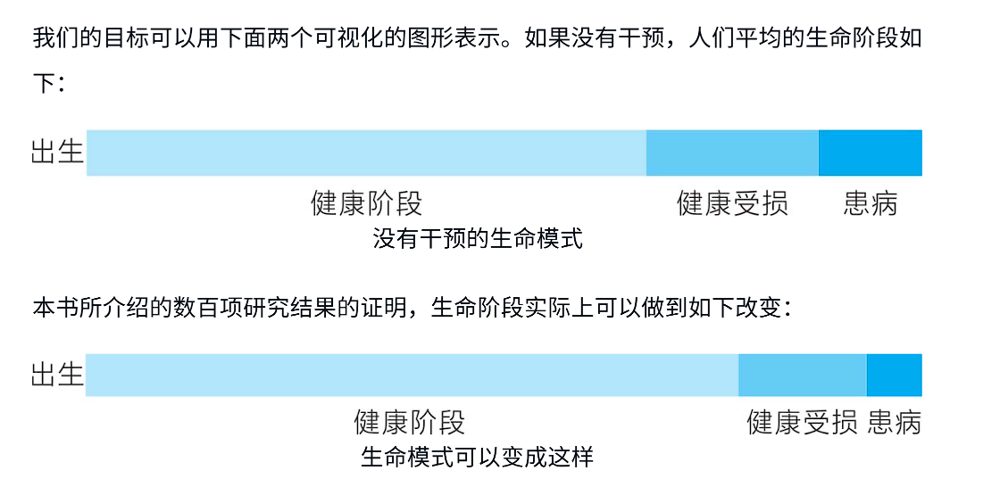
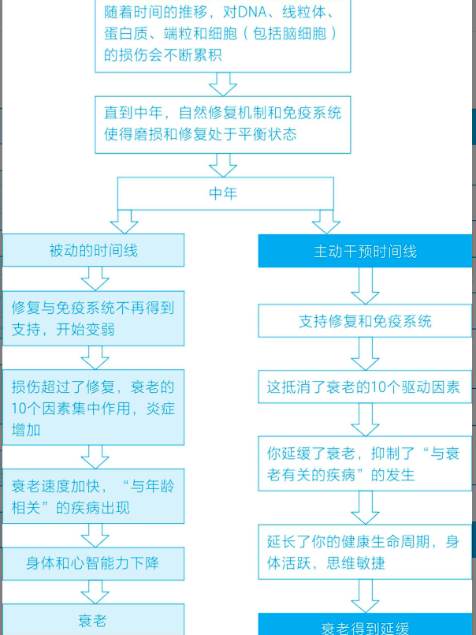
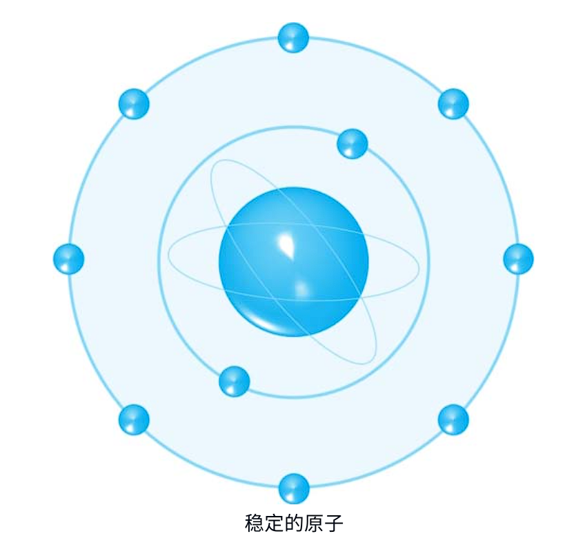
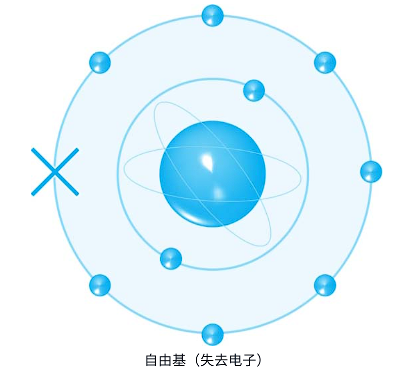

# 衰老的标志 vs 应对策略（食物、营养素和运动）
| 衰老的标志              | 如何应对？对付衰老威胁的食物、营养素和运动                                                                                                                          |
| ------------------ | ---------------------------------------------------------------------------------------------------------------------------------------------- |
| 1. 细胞衰老            | **通过衰老细胞裂解剂增加自噬**：含有黄酮类化合物的水果和蔬菜，特别是含有非瑟酮的草莓、蘑菇、豌豆和发酵食品，烟酰胺形式的维生素 B₃，麦芽中的亚精胺，葡萄籽提取物，类胡萝卜素（叶黄素、番茄红素和 β-胡萝卜素），奥米伽-3，大豆中的染料木黄酮；**运动/活动**，**热量限制** |
| 2. DNA 损伤不断积累      | **促进 DNA 修复**：通过 NAD+ 增加膳食抗氧化剂并促进 SIRT 蛋白（去乙酰化酶蛋白）。含有多酚和黄酮类化合物的水果和蔬菜，烟酰胺形式的维生素 B₃、维生素 D₃、维生素 K 和叶酸、硒、锌、类胡萝卜素、绿茶、姜黄素、葡萄籽；**运动/活动**，**热量限制**     |
| 3. 线粒体功能失调         | **促进线粒体修复**：烟酰胺、维生素 E、复合 B 族维生素、硒、锌、辅酶 Q10、奥米伽-3、姜黄素、绿茶、黄酮类化合物                                                                                 |
| 4. 有益基因被关闭，有害基因被打开 | **触发表观遗传改变**：增加谷胱甘肽的水平，以其中富含硫和蛋氨酸的甲基供体食物为特色。叶酸、甜菜碱、胆碱、黄酮类化合物，活化丁酸盐的益生元纤维食物（包括大蒜、韭葱、洋葱），增加发酵食品；**运动/活动**，**热量限制**                               |
| 5. 端粒变短            | **减缓端粒的损耗**：奥米伽-3、维生素 D₃、叶酸、甜菜碱、维生素 B₁₂、橄榄油、黄酮类化合物、类胡萝卜素、坚果、种子；**运动/活动**，**降低压力水平**                                                            |
| 6. 干细胞的消耗          | **减少干细胞的损失**：维生素 D₃、浆果多酚、绿茶；**热量限制**，**运动/活动**                                                                                                 |
| 7. 营养传感能力减弱        | **下调 IGF-1 胰岛素感应和 mTOR；增加 AMPK 和去乙酰化酶的水平**：可溶性膳食纤维食物、富含多酚的水果（尤其是浆果）、十字花科蔬菜、姜黄素、奥米伽-3、植物而不是动物蛋白、大豆异黄酮；**运动/活动**，**限制热量**                        |
| 8. 细胞间通信不畅         | **减轻炎性衰老**：多酚、胆碱、肌醇、奥米伽-3；低剂量阿司匹林？                                                                                                             |
| 9. 蛋白质积累的错误        | **支持保持蛋白质稳定的伴侣分子；减少蛋白质折叠错误；改善自噬**：绿茶、绿茶提取物、姜黄素、槲皮素、亚麻子、葡萄籽提取物、橄榄油、香料、大蒜；**热量限制**，**运动/活动**                                                     |

# 其他对健康的威胁 vs 应对策略
| 其他对健康的威胁 | 如何应对？抵消威胁的食物、营养素和运动                                                                                         |
| -------- | ----------------------------------------------------------------------------------------------------------- |
| 微生物组不平衡  | **增加益生元 / 高膳食纤维食物并尝试益生菌**：全谷物、菜豆、豌豆、鹰嘴豆、蔬菜，发酵食品如德国酸菜、味噌、开菲尔乳、酸奶；尝试多菌株益生菌补充剂                                 |
| 免疫系统衰老   | 多吃水果和蔬菜，特别是红莓、柑橘类水果；发酵食品和可发酵纤维食品（如豆类、豆科植物和蘑菇）；全谷物、坚果、种子；在冬季（深色皮肤的人则全年）补充维生素 D；考虑 1-3、1-6 β-葡聚糖补充剂；**运动/活动** |

# 备注

最佳选择：全系列的维生素与矿物质
所有的衰老标志和其他威胁也需要全系列优化组合的 23 种基本维生素和矿物质 来应对。

# 表二：延缓衰老综合饮食计划

## 绿色食物

* **频率**：每天 2 份
* **示例**：西蓝花、莴苣类、菠菜、卷心菜、羽衣甘蓝、花椰菜、芽甘蓝、芝麻菜、芦笋、青椒、豌豆、小胡瓜/西葫芦、芹菜、绿叶沙拉、荷兰豆/甜豌豆

## 红色食物

* **频率**：每天 1–2 份
* **示例**：草莓、树莓、樱桃、红葡萄、红椒、红洋葱、番茄、苹果、辣椒

## 黄色与橙色食物

* **频率**：每天 1–2 份
* **示例**：胡萝卜、红薯、橙子、柚子、芒果、杏、南瓜、香蕉、甜玉米、笋瓜

## 蓝色与紫色食物

* **频率**：每天 1–2 份
* **示例**：蓝莓、越橘、黑莓、黑加仑、黑葡萄/康科德葡萄、葡萄干、李子、茄子、甜菜根

## 全谷物

* **频率**：每天 2 份
* **示例**：全麦面包、麦片、意大利面、大米、燕麦、藜麦、荞麦、黑麦、大麦等

## 水果 / 蔬菜汁

* **频率**：最多每天 1 份
* **说明**：单一或混合水果或蔬菜（纯水果/蔬菜，不加糖）

## 益生元与高膳食纤维食物（除水果、谷物和蔬菜中的膳食纤维外）

* **频率**：每周 4–5 次
* **示例**：洋葱、大蒜、韭葱、朝鲜蓟、小扁豆、香蕉、豆类（云豆、扁豆、红芸豆、黑眼豆等）、鹰嘴豆及其加工品（如天贝、鹰嘴豆泥等）
* **补充**：偶尔添加发酵食品，如德国酸菜、味噌、开菲尔乳、天贝

## 蘑菇

* **频率**：每周 3 次
* **示例**：栗蘑、双孢蘑菇、平菇、香菇、灰树花、鸡油菌、灵芝

## 草药与香料

* **频率**：尽可能频繁使用
* **示例**：姜黄、生姜、卡宴辣椒、辣椒、咖喱粉、罗勒、百里香、黑胡椒、肉桂、牛至、迷迭香、肉豆蔻、鼠尾草、香菜等
* **说明**：对健康有益并增加风味，可减少对盐的需求

---

## 大豆及其制品

* **频率**：每周 1–2 次
* **示例**：豆腐、毛豆、味噌、大豆组织化蛋白、纳豆

## 坚果与种子

* **频率**：每天一小把
* **坚果示例**：核桃、腰果、花生、杏仁、巴西果
* **种子示例**：亚麻子、奇亚籽、大麻籽、芝麻、松籽、南瓜子

## 油性鱼类（可选择）

* **频率**：每周 2–3 次
* **示例**：鲑鱼（特别是野生鲑鱼）、鲱鱼、鳟鱼、鲭鱼、沙丁鱼
* **补充**：偶尔食用甲壳类，如虾（含硒、锌）

## 肉类（可选择）

* **频率**：每周 1–2 次
* **示例**：鸡肉、火鸡、野味、鸭肉、羊肉
* **说明**：每天每千克体重大约需要 1 克蛋白质；可能的话选择有机/散养动物肉类

## 鸡蛋（可选择）

* **频率**：最多每周 7 个
* **说明**：有机/散养母鸡的鸡蛋通常营养更高

## 乳制品（可选择）

* **频率**：适量
* **说明**：乳制品可补充钙、镁和维生素，但蔬菜中也含这些物质
* **建议**：选择有机牛奶和黄油、真正的奶酪（尤其是绿色和蓝色奶酪）、原味“活性”酸奶

## 植物脂肪和油类

* **频率**：按需要
* **建议**：

  * 沙拉/一般烹饪：特级初榨橄榄油、亚麻籽油或大麻籽油
  * 高温油炸：鳄梨油

## 黑巧克力

* **频率**：每天 2–3 块
* **说明**：可可黄酮醇更健康；比牛奶巧克力含糖更少，且不含乳制品

## 饮料

* **频率**：经常
* **建议**：相当于 6–8 杯的水基饮料：水、茶（绿茶、红茶、洋甘菊茶、药茶）、咖啡
* **补充**：适量红酒（女性每天 1 杯；男性 1–2 杯）

**人们总是不能严肃地对待自己的健康问题，直到病来了才着急起来，但常常为时已晚。好消息是，采取措施保持健康并不非常复杂。**

例如，我在书中提到，日本的冲绳岛是世界上7个长寿地区之一。当地居民的长寿秘诀之一是“腹八分”(Hara Hachi Bu)，意思是：吃到八分饱就停下来。本书译者李华民先生告诉我，这个说法其实来自中国谚语“吃饭八分饱”​，也就是说，​“**吃饭八分饱**”是中国人的长寿智慧。

* 以饮食模式和运动为手段，以慢性疾病防御为目标，全方位引导健康的生活方式

* 随着年龄增长而出现的疾病不仅给老年人带来身心痛苦，也给个人、家庭和社会带来沉重的经济负担。已经或者正在步入老年的人们都在思考如何做到健康地衰老，即到了**晚年不得病或少得病**，健健康康地走完自己的一生。

* 本书以大量的科学研究论文（附参考文献）为依据，从现代科学的角度揭示了人体衰老的奥秘，并提出可能的延缓衰老的科学方法，以期在延长寿命的同时提高生存质量。和其他养生书籍不同的是，本书的许多论点都采用已经发表的科研成果作为论据，科学性更强。

# 衰老并不意味着受疾病折磨

大多数人都接受“衰老意味着受疾病折磨”的观点—精力衰退，遭受心血管疾病、脑部疾病、癌症、关节疼痛，身体越来越衰弱。他们经常会耸耸肩说：​“这就是生活。​”
然而，你可能会很高兴地得知：上面大多数人的想法是错误的。过去十年中，像哈佛大学医学院、剑桥大学、牛津大学、伦敦大学学院和加州大学伯克利分校这些院校的研究人员都得出了另外的结论。

* 衰老是一个可塑的过程，你可以直接影响自己衰老的速度。

* 如果人类的衰老能够延缓，大多数与衰老有关的疾病都会减少，这些疾病包括癌症、阿尔茨海默病等痴呆症、心血管疾病、2型糖尿病、失明和骨质疏松等。

# 延续健康，而不仅仅是延续生命

* 延长健康的寿命不仅会对个人生活质量带来变革性影响，也会带来巨大的经济收益。

* 我们的目标不是去寻找能够活到150岁的想象中的“长生不老的灵丹妙药”​，那对于地球将是毁灭性的；而是要去延长可以与家人过上健康、幸福和美满生活的时间—尽管这也可能同样延长我们的生命。

* 除非生活充满乐趣，否则长寿没有意义。

* 我们的另一个目标是对社会作出富有成效的贡献。确实，一大批身体健康的老年人仍然在工作。例如，做慈善事业，在经济上有所贡献，参与到改善当地环境的项目中等，都可以极大地造福于社会。

* 我们当前的医疗保健模式存在缺陷：这个模式侧重于治疗而不是预防。他们在等待疾病的出现，然后用“灵丹妙药”进行消灭。事实上比这还要糟糕。大多数的情况下，病人没有被治愈，而是带着疾病继续生活，也不是死于疾病。

* 幸运的是，我们现在知道如何将组织和器官的功能恢复到年轻的状态，知道如何区分生物学上的衰老和年龄增长的衰老，知道如何延长“健康期”而不仅仅是寿命期。

# 衰老标志

这些标志是我们所有人共同的生物过程。这些隐蔽的衰老因素如果不被清除，将不可避免地导致与衰老相关的疾病。

我阅读了数百份研究报告，并且与健康专家们进行了讨论。科学的结论是明确的：这些衰老的标记或标志中的每一个都可以变慢、减缓，在某些情况下，甚至可以停止或者逆转。真的有研究人员发现，他测试的对象确实出现了衰老的逆转。

## DNA损伤的积累

DNA损伤的积累会导致基因不稳定、基因突变和细胞功能丧失。基因损伤是衰老和癌症的至关重要的因素，并且与阿尔茨海默病、心脏病紧密相关。但是，细胞的修复水平是有可能被提高的。

## 细胞的衰老

当细胞衰老，无法发挥正常作用的时候，通常会有新的健康细胞代替它。但是，随着年龄的增长，有些细胞产生了退化，但不会完全死亡。

这些衰老的细胞像“僵尸”一样徘徊，释放出能够导致炎症的毒素。炎症会促使衰老，是导致动脉粥样硬化、心脏病、糖尿病、痴呆症和关节炎的关键因素，并且为癌症细胞扩散创造了条件。好消息是，研究人员已经发现了清除“僵尸细胞”的方法。

## 线粒体功能失调

线粒体是几乎每一个细胞中的“发电厂”​。线粒体功能失调会导致能量丧失、肌肉无力、疲劳和认知问题。然而，有些特定的食物和营养素可以促进线粒体的修复。

## 有益基因被关闭，有害基因被激活

人们的基因是固定的，但是它们的表达方式（激活或者关闭）是可以有效控制的。科学家们称之为“表观遗传改变”(epigenetic change)。我们将看到，某些食品和生活方式能够激活有助于健康的基因，关闭导致疾病的基因。

## 干细胞耗尽

根据需要，干细胞可以发展成为不同的细胞类型，从脑细胞到肌肉细胞。但是，成人身体内的干细胞有限，并且随着年龄增长而减少。然而，人们可以减缓干细胞的消耗速度。

## 细胞无法正常沟通

细胞需要互相“交谈”并感知彼此的边界，否则，疾病，特别是癌症就会出现。幸运的是，有一些特定的营养素可以改善细胞之间的沟通。

## 端粒变短

端粒(telomeres)位于染色体的末端，是微小的DNA的“帽子”​，它们也可以被比喻为像鞋带端部的“帽子”​。当细胞分裂的时候，这些“帽子”​，也就是端粒，就会变短。如果这些端粒缩短太多，或者受到损害，细胞就会死亡或者衰老。

你将看到，特定的食物和营养素可以协助维持端粒的长度和健康。

## 身体无法正确感知营养摄入

这不仅导致人体的超重，还会导致对于诸如胰岛素等关键激素的反应迟钝，从而导致糖尿病和其他很多疾病，身体脂肪与肌肉的比值也会增加。当然，细胞对于营养不良或者营养过剩的感知能力是可以大大改变的。这不仅仅对衰老，对于保持健康的体重都是很重要的。

## 蛋白质积累错误

我们都认为蛋白质只是我们食物的一部分。事实上，我们制造了成千上万种蛋白质，这些蛋白质在细胞中完成了大量工作。它们传递信号，把氧气送到身体的各个部位，创建胶原蛋白等结构，创建免疫抗体，并且读取在DNA中储存的遗传代码。

但是，蛋白质一旦变形，它们就不能正常工作。它导致器官失常、骨质变弱和免疫功能下降。我们要找出来降低蛋白质错误水平的方法，否则，蛋白质的错误就会随着时间的推移而增加。

## 微生物组变得不平衡

微生物组是生活在肠道中的微生物的集合。当好细菌和坏细菌比例失调时，导致食物的新陈代谢变差，免疫系统变弱，从而出现很多健康问题。

最新研究还表明，由于肠道与大脑是直接相关的，在微生物组合失调的时候，人们的情绪和大脑的功能会直接受到不利影响。

因此，可以在饮食中增加更多的发酵食品和膳食纤维，采用地中海式饮食，时而添加点儿益生菌，从而改善肠道健康。

# 我们的目标

## 死亡是不可避免的，但衰老并不是必然的。

## 我对于寻找能够活到150岁的途径不感兴趣，因为那将对于我们居住的地球带来很大的麻烦。但是，如果我们可以让人们摆脱养老院的护理，减少阿尔茨海默病和帕金森病患者的数量，那将是很理想的。​

## 我们更擅长让人们生活在各种衰老引起的疾病中，却很少让他们完全恢复健康……

## 我认为，如果我们能够从一开始就防止他们生病，那将对个人的生活质量带来很大的改善，对他们经济上的影响也会得到改善。

## 预防远远重于治疗。

# 来自僵尸细胞的诅咒

人体内数万亿个细胞在一直不断地运动着，他们不断复制并最终死亡，死亡的细胞每天有大约500亿个。

正常细胞的死亡是通过所谓凋亡的过程发生的。那些死亡的细胞通常会通过所谓自噬的重要过程被免疫系统清除。

成功的自噬对健康是非常重要的。在自噬(autophagy)这个词中，auto意为“自我”​，phagy意为“吃掉”​。

然而，有时无法清除掉死去的细胞或它的碎屑，它们被称为衰老细胞。衰老细胞遭受了不可逆转的损害，却没有从人体内清除掉。衰老细胞的数量随着时间而增加，造成了免疫系统受损。

科学家们有时会将衰老细胞称为“垃圾细胞”或者“僵尸细胞”​。巴克衰老研究所的朱迪斯·坎皮西(Judith Campisi)最近的一项研究表明，这些衰老细胞会分泌出破坏性的化学混合物，毒害周围的组织，导致慢性（长期）炎症。这些炎症是衰老、心脏病、关节炎和癌症的主要驱动因素。

## 慢性炎症

细胞和组织的内部损伤在一开始也会引起相同的免疫应答。但是，免疫应答并不会完全停止，而是维持在一个很低的水平。因此，炎症持续存在，而且变成慢性的了。

这种慢性（长期）炎症是导致几乎所有年龄相关性疾病的潜在原因，包括心血管疾病、糖尿病、癌症、抑郁症、阿尔茨海默病，以及可见和不可见的衰老现象。

衰老细胞对人体非常有害—它们会破坏其周围的组织。

即便未被清除的衰老细胞数量很少，它们也会引发问题，就像一颗烂草莓会使一篮子草莓变质一样。请记住这个比喻，当我们揭开这项最新的研究时，它会具有特别的意义。

## 如何清除衰老的“僵尸细胞”

那么，如何清除衰老细胞呢？答案是使用衰老细胞裂解剂(senolytics)，其定义是寻找、破坏和清除衰老细胞的分子。

有些药物似乎可以做到这一点，例如抗癌药达沙替尼(dasatinib)和Bcl-2抑制剂navitoclax。治疗糖尿病的药物二甲双胍可能也有这个作用。但是，如果不与黄酮类化合物结合使用，其自身不可能很好地发挥作用。

黄酮类化合物是一类存在于蔬菜和水果中的营养素。与蔬菜和水果所提供的维生素和矿物质一样，对健康至关重要。它们包括植物中的色素，如叶黄素、番茄红素、β-胡萝卜素等。很多黄酮类化合物也具有抗癌特性和抗衰老的作用。

### 非瑟酮：一种强大的抗衰老黄酮类化合物

最强大的具有衰老细胞裂解活性的黄酮类化合物称为非瑟酮(fisetin)，似乎还是鲜为人知的色素。它们是在草莓中发现的，其含量比仅次于它的苹果高6倍。明尼苏达大学衰老与代谢生物研究所首席研究员对《新闻周刊》说：“我们正在寻找能够杀死这些受损的衰老细胞的药物。这些衰老细胞对我们的身体有毒害，并且随着年龄的增长而积累起来。已有研究表明，非瑟酮是一种天然物质，可以选择性地有效杀死这些衰老细胞。”你可能注意到，她并没有建议你多吃草莓，这也不奇怪。大多数研究人员本能的反应就是将天然产品制成药物，因为这样可以获得专利，并且有利可图。

### 亚精胺

按照含量的从高到低，研究者在小麦胚芽、大豆、蘑菇（尤其是香菇）​、蓝纹奶酪、陈年切达奶酪、豌豆、一些坚果及一些发酵食品（包括德国酸菜和味噌）中发现了亚精胺。该化合物最早是在精液中发现的，因此有了这个不光彩的名字（译者注：亚精胺spermidine中的sperm意为精液、精子）​。

事实上，根据最初发表在《自然医学》(Natural Medicine)的一篇研究论文，亚精胺是一种新的长寿、延续健康生命年限的明星分子。其第一作者托比亚斯·艾森伯格(Tobias Eisenberg)指出：“口服补充亚精胺这种天然多胺可以延长小鼠的生命并发挥保护心脏的作用。

发表在《老年病学》(Gerontology)上的其他研究表明，其长寿效应的原因是，亚精胺既促进了健康的自噬，又起到了衰老细胞裂解剂的作用。

亚精胺也可以在肠道微生物组内自然产生。尽管人体—男性和女性—会产生亚精胺，但是量会随着年龄的增长而下降。因此，一些衰老研究人员认为，补充益生菌有助于提高多胺，如亚精胺的水平。最有希望能促使多胺产生的益生菌的似乎是乳双歧杆菌。

### 运动

2016年《糖尿病》(Diabetes)杂志上的一篇报告指出，运动有助于减少衰老细胞的数量。

### 维生素B3（烟酰胺）​：另一种已经被证实的衰老细胞裂解剂

烟酰胺是维生素B3的形式，它与烟酸不同，不会引起面部潮红。烟酰胺也已经被证明是一种衰老细胞裂解剂，有助于清除衰老细胞。市场上已经有联合了白藜芦醇、槲皮素（在洋葱和苹果中发现的黄酮类化合物）和烟酰胺的营养补充剂，作为一种建议的衰老细胞裂解剂组合。但是，他们有些操之过急。部分原因是，关于将白藜芦醇和槲皮素作为衰老细胞裂解剂的研究还没有定论。更重要的是，衰老细胞裂解剂并不是抗衰老的全部内容。

## mTOR通路

mTOR通路是细胞内的一条通道，可以调节该细胞的生命周期—其生长、修复和自然死亡。虽然科学原理相当复杂，但是关键如下。

mTOR可以感知营养的摄入。当它感知到营养充足的时候，细胞就会复制。

当它被抑制的时候，就停止复制，细胞进入修复模式。

当它被过度刺激的时候，就促使细胞过度生长，甚至发展成肿瘤。

这是一个很平衡的周期。有时，你希望抑制或下调mTOR，以保证细胞修复机制能够正常运作。

抑制mTOR的一种方法就是**限制热量摄入**，我们知道这样会改善细胞修复，增加有机体的寿命。很多人禁食就是这个原因。

但是，很难做到依靠饥饿来延缓衰老、更长久地健康生活。后面我们会看到，可以用我们能够忍受的简单方法来限制热量。

## 降低mTOR可以增加细胞修复

需要记住的关键事实是，要增加细胞修复，从而促进健康长寿。因此，需要下调或者抑制mTOR通路。

### 天然mTOR抑制剂

最有效的、天然的mTOR抑制剂包括：姜黄素、EGCG（绿茶中的成分）​，奥米伽-3，橄榄油、吲哚（indoles，西蓝花、芽甘蓝和羽衣甘蓝中的化合物）​，染料木黄酮（genistein，大豆中的一种具有抗癌作用的化合物）和维生素E。

其他mTOR抑制剂包括葡萄籽提取物、非瑟酮（还是它）和槲皮素（在很多水果和蔬菜中发现的天然色素和黄酮类化合物，包括洋葱、苹果、红葡萄、树莓、樱桃、西蓝花和绿茶）​。

应当注意，有些因素可能会过度刺激mTOR通路，特别是**过量的蛋白质**，尤其是动物蛋白，这是很危险的。因为如果mTOR感知到营养摄入过多，就会过度复制细胞，而癌症的特征就是细胞复制不受限制。

## 老细胞的废物处理

拼图的最后一块是，调低mTOR还会鼓励自噬这个基本过程，从而获得频繁的“春季大扫除”的效果；或正如一位研究人员所说：​“它充当老细胞的垃圾处理系统。​”

间歇性禁食也会增加自噬，道理如下：禁食带来“轻度压力”的挑战，使得mTOR进程发挥了作用。

# 每周吃一次草莓

衰老细胞裂解研究令人鼓舞的一个观点是，显然不需要每天都采取行动。偶尔（大概每周）进行一次清理效果也很好。那么，我们为什么不每周吃一大碗草莓呢？对于大多数人，这不是一件难事。如果草莓过季了，吃灌装或冷藏的也可以。

* 清除已经死亡但是仍然存在于体内的衰老细胞，防止他们产生毒性，导致炎症，进而导致很多与衰老相关的疾病，包括骨关节炎、心脏病、关节炎、某些癌症和阿尔兹海默病。

* 我们需要鼓励自噬，因为它可以清除衰老细胞的尸体。

* 降低mTOR的活性会促进细胞修复过程，否则该过程会随着时间的推移而逐渐变弱。降低mTOR的活性还能够清除“僵尸细胞”​。

* 有多种天然化合物可以做这些事情，包括烟酰胺（维生素B3）​，草莓、蓝莓、姜黄（其主要营养成分是姜黄素）​、绿茶、葡萄籽、绿叶蔬菜、洋葱和大蒜中的黄酮类化合物。叶黄素、番茄红素、和β-胡萝卜素等类胡萝卜素也能起重要作用。

* 运动对于清除衰老细胞同样重要。

# 修复受损DNA

人体内有大约37万亿个细胞，即37000000000000个。每天约有500亿个细胞死亡并被替换，数百万的DNA被损害。这种损害是不可避免的，因为生命和呼吸的每一个动作都会造成DNA的损害。DNA损害的最大原因是，食物被氧化代谢时，在线粒体内产生能量，这个过程会引起“氧化损伤”​，是氧与脂肪和葡萄糖产生反应而导致的。

你一定看到过氧化损伤的例子：氧与葡萄糖反应，使苹果变为棕色；或者氧与脂肪反应，使鳄梨变成棕色；或者更简单的，氧气导致生锈。

细胞（尤其线粒体）在把食物“燃烧”成能量时，会产生一些高活性的副产物，最典型的是 活性氧（ROS）。ROS 能攻击 DNA、细胞膜脂质、蛋白质，造成所谓氧化损伤。

氧化损伤也被称为“自由基损伤”​，而DNA和细胞膜的自由基损伤是衰老的直接原因，与动脉硬化、皱纹的形成和癌症有关。

## 自由基

当氧与脂肪或葡萄糖发生反应时，会引起氧化损伤，该过程的产物就是自由基。当电子从原子上剥离时，就会产生自由基。这是一个高度不稳定的状态，因为电子总是成对存在，所以自由电子总是迫切地寻找另一个电子进行配对。这会导致电子窃取其他电子并破坏细胞和DNA的一系列连锁反应，直到抗氧化剂将它的一个电子捐赠出去，才能最终达到稳定。

## DNA损伤与癌症

尽管细胞中DNA损伤是癌症的主要原因，但是受损细胞变为恶性细胞仍需要时间，因为细胞中首先要积累数十个甚至数百个突变。

此外，导致细胞增殖失控的基因（癌基因）必须被激活，导致突变细胞自杀的基因（肿瘤抑制基因）必须被关闭。

很多肿瘤，如乳腺或肠道肿瘤，需要10年的过程才能被检查出来。而还有一些肿瘤，如前列腺癌，则需要20年到30年的时间，甚至更长。这解释了癌症为什么与年龄有关，但是也说明我们有机会采取一些措施来中断这个过程，也解释了为什么癌症筛查非常重要。如果大多数癌症可以尽早发现，就可以在其扩散转移之前进行治疗。

## 造成DNA损伤的原因

造成DNA损伤的其他原因包括吸烟、污染、农药、紫外线、高温烧烤所烧焦食物上的棕色分子、过量饮酒、萨拉米香肠和培根等加工肉类中的防腐剂，以及红肉的高铁含量触发的氧化。

由于自由基损伤还可能由氧与葡萄糖反应而引起，所以可以减少含糖食品和像糖一样在人体内代谢的精制碳水化合物，从而减少自由基的负担。还可以少吃一点，因为进食就会升高血糖。

食物中的抗氧化剂，以及人体内产生的抗氧化剂有助于中和氧化损伤。因此，食用抗氧化剂含量高的食物也是健康衰老的原因之一。

尽管抗氧化剂对于保护DNA是必须的，但这还不够。事实上，已经证明抗氧化补充剂本身，如维生素A、维生素C、维生素E和硒，对于减少心脏病和癌症的作用有限。

问题的**关键是要支持自己的DNA修复机制**，而不是去试图预防自由基的破坏，那太困难了。

## 如何支持DNA修复

人体具有强大的天然DNA修复机制。但是，如果不予支持，它们会随着时间的推移变得越来越弱。研究证明，各种各样的植物性食物及植物性食物中的营养成分有助于主动支持DNA修复，有时还可以将损害逆转。它们包括：

### 类胡萝卜素高的食物

类胡萝卜素含量高的食物：例如β-胡萝卜素（存在于胡萝卜、红薯、羽衣甘蓝和菠菜中）​、叶黄素（存在于羽衣甘蓝、菠菜、蛋黄中）和番茄红素（存在于熟番茄、葡萄柚、紫甘蓝中）​。​《英国营养学杂志》(British Journal of Nutrition)上刊登的一项研究表明，补充混合的胡萝卜素可以改善DNA的修复机制。

瑞典隆德大学的另一项研究表明，烟酰胺（维生素B3的一种形式）​、锌和类胡萝卜素的组合可以增强细胞对于DNA破损的抵抗能力。

硒含量高的食物：例如全谷物、巴西栗和腰果、鱼和鸡肉。硒似乎可以激活一个被P53蛋白质控制的基因。该蛋白质有助于修复DNA并抑制肿瘤的形成，大豆异黄酮和姜黄素就有这样的效果。

叶酸：谢菲尔德大学的一项研究表明，补充叶酸可以减少DNA的损伤。

北卡罗来纳大学对1700人的进一步长期研究发现，硒与叶酸的组合对于结肠癌有预防作用。

英国癌症研究会的科学官证实，修复DNA需要叶酸（一种B族维生素）​，​“因为对细胞DNA的破坏会导致癌症”​。

天然叶酸(folate)存在于鸡蛋、绿叶蔬菜和全谷物中。合成叶酸(folic acid)是其补充剂的形式，其吸收量是天然叶酸的两倍。​（译者注：folate和folic acid是维生素B9的不同形式。前者以天然形态存在于食物中，后者是人工合成的。为不引起误解，在不须说明二者区别的时候，本书将两者都译为“叶酸”​。​）

富含黄酮类化合物的食物：黄酮类化合物是植物营养素(phytonutrients)多酚类中的一大类。黄酮类化合物存在于水果和蔬菜中，对健康至关重要。

水果：支持DNA修复的主要水果是柠檬、树莓、草莓、苹果，尤其是蓝莓。

蔬菜：已知可支持DNA修复的蔬菜为菠菜、芹菜、大蒜和十字花科蔬菜，如西蓝花、豆瓣菜、卷心菜和羽衣甘蓝。在爱丁堡大学的一项试验中，受试者每天进食3/4杯不起眼的豆瓣菜，他们的DNA损伤显著降低了。

《英国癌症杂志》(British Journal of Cancer)上发表的另一项实验显示，在卷心菜、西蓝花和羽衣甘蓝中存在的名为吲哚-3-甲醇(indole-3-carbinol)的化合物，以及在大豆和大豆异黄酮补充剂中存在的染料木黄酮，都可以增加能够修复DNA损伤的两种蛋白质。

香料与草药：已知能够促进修复DNA的香料和草药包括姜黄素，它存在于姜黄中，因此也存在于咖喱中。一项2017年的研究表明，服用具有抗肿瘤作用的姜黄素可以使DNA损伤减半，因为它还可以增强过氧化氢酶的活性，这种酶是自由基强大的中和剂。

生姜是姜黄的亲戚，它与欧芹和迷迭香一起有助于DNA修复。

在饮用绿茶一小时后，DNA修复酶的活性就增强了。这种酶的名字有点好笑，叫作OGG1。发表在《致癌作用》(Carcinogenesis)杂志上的另一篇研究表明，绿茶多酚有助于引起前列腺癌细胞的自我毁灭。

最后，说说葡萄籽和葡萄籽提取物，它们也支持DNA修复，导致癌细胞自我毁灭。

动物（人类）与植物之间存在着一百万年的协同进化，这可能是医学上很多重要的治疗方案都是源于植物的原因。

## 去乙酰化酶：主导衰老的开关

衰老是生命中一遍又一遍地复制细胞时丢失信息而导致的。但是，有一组物质包含7种蛋白质，叫作去乙酰化酶(sirtuins)，可使细胞保持稳定并有助于防止信息丢失。

有的去乙酰化酶在线粒体中起作用，有的在细胞核中起作用。它通过激活和关闭基因来维持细胞的稳定性。这个过程称为表观遗传学(epigenetics)

大量研究证明，去乙酰化酶蛋白需要一个称为NAD+（全称为：氧化烟酰胺腺嘌呤二核苷酸，oxidised nicotinamide adenine dinucleotide）的分子，该分子于1906年首次被发现，它天然存在于所有细胞中。它在数百个新陈代谢过程中非常重要，包括产生细胞能量。但是，随着年龄的增长，其水平一直在下降。由于NAD+可以提高细胞修复DNA损伤的能力，科学家们一直在寻找提高NAD+水平的方法。

### 用营养素增加NAD+

要想产生NAD+，人体需要有所谓的“前体物质”(precursors)，即产生NAD+所必需的重要营养素。维生素B3的所有主要形式都能做到这一点，无论是烟酸、烟酰胺或烟酰胺核糖。

为了增加NAD+的水平，辛克莱尔博士亲自服用烟酰胺核糖补充剂，并且每日服用维生素D、维生素K、低剂量阿司匹林和整整1克白藜芦醇。白藜芦醇是一种黄酮类化合物，主要存在于蓝莓和越橘中，也存在于花生、黑巧克力、葡萄和红酒中。

最后，他服用1克糖尿病药物二甲双胍，以降低血糖水平和增加人体对于胰岛素的敏感性。但是，二甲双胍是处方药，普通人不大可能使用。然而，正如我们所知，还有其他非药物可以降低血糖水平并提高胰岛素敏感性。

尽管在动物实验中，烟酰胺核糖似乎是制造NAD+的一条略微更有效的途径，但其价格昂贵。此外，尚未证实烟酰胺核糖在人体内比烟酰胺形态的维生素B3更优秀。因此，我认为，旨在补充能量或修复DNA的任何补充剂中，使用烟酰胺形态的维生素B3是有意义的。烟酰胺的食品来源包括酵母、牛奶、鱼、坚果、鸡肉和蘑菇。

还有其他方法可以增加NAD+，从而来促进DNA修复。在营养充足的时候，去乙酰化酶蛋白主要支持细胞增殖。但是，当人体面临挑战（中等而非致命水平压力）的时候，去乙酰化酶的作用就会从细胞增殖转换到专注于支持DNA修复。

什么叫作中等压力？包括暴露于寒冷、间歇性（短期）禁食、短暂的高强度运动等。这些以后还会谈到。

* 很多植物性食物、维生素、矿物质和多酚可以部分保护和修复DNA。

* 我们特别谈到了叶酸、维生素B3（烟酰胺）​、硒、类胡萝卜素、叶黄素、番茄红素和β-胡萝卜素、绿茶和葡萄籽中的黄酮类化合物、姜黄素、白藜芦醇和大豆中的染料木黄酮。

* 我们还谈到了运动和研究人员所说的间歇性（短期）禁食。对于大多数人来说，​“禁食”一词令人反感。虽然少量减少热量摄入也是延缓衰老计划的一部分内容，但你会看到如何使用简便而且创新的方法来实现这个目标。

# 线粒体：精力来源！

线粒体功能失调是导致疲劳和精力不足的根本原因，也是衰老的10个关键原因之一。线粒体功能减弱导致了神经系统、新陈代谢、肌肉和心脏的失调。

线粒体是体内几乎每一个细胞（红细胞除外）内的微型“发电厂”​。他们摄取食物和营养，在氧的参与下分解为葡萄糖，产生一种称为ATP的化合物形式的能量。

然后，ATP推动了人体细胞内每一秒钟发生的数百万次生化反应。酶加速了细胞内新陈代谢的过程，产生能量和蛋白质。

ATP提供了每一次肌肉运动、心跳和神经信号（包括脑神经信号）所需的能量。大脑使用了人体产生的所有ATP的70％左右，这个事实解释了线粒体功能障碍与神经退行性变有明显联系。

因为人体不能储存ATP，所以体内产生的ATP的量非常巨大。根据2016年《科学文献索引》(Science Direct)数据库的计算，人体每天生产与其自身重量相等的ATP！在此过程中，能够产生1200瓦的电能，足够驱动一台普通洗碗机工作40分钟。

在哺乳动物中，所有这些活动的副产品是热量，以及不可避免的线粒体内和细胞内自由基的损伤。自由基的损伤会导致突变、蛋白质畸形，并且使细胞无法产生能量。此外，该过程还会破坏（氧化）进入血液的脂肪，从而导致动脉硬化。

如果线粒体DNA受到损伤，罹患癌症和神经系统变性疾病的风险就会增加。​《整合医学》(Integrated Medicine)杂志2014年的一篇评论文章证实：“线粒体功能障碍……是衰老的一种特征，其本质上是所有慢性疾病的特征，包括心血管疾病、糖尿病和代谢综合征。”

## 线粒体有自己的DNA

可以相信，线粒体DNA（通常写作mtDNA）在几百万年之前某个动物细胞吞噬了某种细菌时就出现了。由于这种细菌能够有效产生能量，就被赋予了进化优势，动物细胞就保留了它。因此，mtDNA是从细胞核的DNA分离出去的。mtDNA是环状的，可以看到其内部标志性的缠绕螺旋。

## 通过营养素防止线粒体DNA损伤

2017年，谢菲尔德大学一个研究小组报告了一项为期5年的研究成果。报告显示了线粒体如何保护自己免受DNA损害并对其进行修复。它涉及一种被称为TOP1的蛋白质。其他研究人员发现，这种修复机制需要全系列的维生素和矿物质，尤其是两种营养素：辅酶Q10(CoQ10)和吡咯并喹啉醌(PQQ)。

CoQ10(co-enzyme Q10)有助于保护线粒体免受损害。而鲜为人知的PQQ(pyrroloquinoline quinone)可以激活有助于在衰老细胞中形成新线粒体的基因。2017年，线粒体医学会发表了一项“共识声明”​，其中支持线粒体疾病患者使用以下药物：辅酶Q10、α-硫辛酸、维生素B2（核黄素）​、叶酸和左旋肉碱。

如果细胞缺乏辅酶Q10或左旋肉碱，就无法产生足够的ATP。这意味着肌肉纤维容易疲劳和心脏搏动强度降低，两者都是衰老的重要标志。

### 辅酶Q10

辅酶Q10在ATP的产生中起着核心作用，但是其在人体内的水平随着年龄增长而降低。它在线粒体的膜中充当强大的保护性抗氧化剂。辅酶Q10还与维生素E协同作用，增强两种营养素的抗氧化作用。

2014年的一项研究发现，辅酶Q10“通过提高SIRT1基因水平增强了线粒体活性”​。由于SIRT1基因形成的去乙酰化酶蛋白质在延缓衰老和减少年龄相关性疾病中起着关键作用，我们看到延缓衰老拼图的另一部分出现了。

辅酶Q10也已经用于治疗和改善心脏病。有些医生还建议用辅酶Q10抵消患者使用他汀类药物所产生的不良反应。

辅酶Q10有补充剂的形式，在花生、小扁豆和一些多脂鱼，如沙丁鱼、鲱鱼和鲭鱼中有少量存在。

### PQQ

这种强大的抗氧化剂已被证明可以与辅酶Q10协同起效，欧芹、绿茶、青椒和鸡蛋都是其很好的来源。

### 维生素B3（烟酰胺）

新的研究表明烟酰胺会引起功能异常的线粒体分解并消散，从而改善线粒体的质量。这个过程称为线粒体自噬，与自噬这种清除受损细胞的重要过程同样重要。

### 欧米伽-3

奥米伽-3存在于鲑鱼、鲭鱼、鲱鱼和沙丁鱼等多脂鱼中。有助于保护线粒体的细胞壁。奥米伽-3也有植物来源，称为ALA（α-亚麻酸）​，但其形态不容易被吸收。奥米伽-3有助于保护大脑中线粒体的功能，并且是任何抗痴呆治疗方案都应有其参与的营养物质.

### α-硫辛酸

它涉及分解碳水化合物以产生能量，而且还是一种抗氧化剂。人体内会产生少量的α-硫辛酸，而食品中的含量却很高，包括绿叶蔬菜，如西蓝花、芽甘蓝、菠菜，还有胡萝卜、亚麻子、大豆和菜籽油。α-硫辛酸除了能够产生能量之外，有时还被建议用作补充剂以缓解糖尿病神经相关症状。现在已知，它可以促进人体自身产生的谷胱甘肽（一种重要的天然抗氧化剂）​，其对清除体内过量的重金属很重要。增加的谷胱甘肽水平也提高了胰岛素的敏感性。

### 左旋肉碱

左旋肉碱的作用是把脂肪酸从食物传输到线粒体中，将其燃烧，获得能量。

像α-硫辛酸一样，左旋肉碱有助于增加自然水平的谷胱甘肽。尽管大多数人会在自己体内生产足够的左旋肉碱（只要他们有足够的维生素C）​，肉类、鱼和牛奶仍是其主要的食物来源。因此，少肉或无肉饮食的老年人有时需要添加左旋肉碱补充剂。

在大多数年龄段都需要补充左旋肉碱的证据并不充分。然而，一项针对70名百岁老人的随机对照临床试验表明，他们在接受左旋肉碱治疗6个月后，身心疲劳明显减轻，身体和认知活动能力也增加了。

尽管左旋肉碱的主要来源是动物制品，但是，只要饮食中含有大量维生素C，也可以从植物蛋白里合成左旋肉碱。所以，大多数人都有充足的水平。

### 其他营养素

对线粒体健康不可或缺的其他营养素还包括：

维生素E：存在于坚果、小麦胚芽、诸如葵花籽那样的籽粒、菠菜和西蓝花之中。

硒：存在于坚果（尤其是巴西栗）​、海鲜和肉类中。

锌：存在于贝类、肉类、豆类、种子、坚果、鸡蛋和全谷物中。

姜黄素：一项2016年的研究表明，补充姜黄素4周足以恢复因糖尿病而受损的肾脏和肝脏中的线粒体功能。

全复合B族维生素（包括叶酸）​：对于将食物转化为能量至关重要。

最后，谈谈绿茶中的活性成分EGCG（epigallocatechin-3-gallate，表没食子儿茶素没食子酸酯）​，它可以激活许多蛋白质，包括对于线粒体正常功能必不可少的sirtuin-1基因。

恢复线粒体的功能可以改善肤色并减少皱纹吗？2018年对于小鼠的一项研究显示，通过饮食表达某些基因后，线粒体功能得以恢复，皱纹被抚平，甚至减少了脱发。

* 需要全面的维生素和矿物质来支持线粒体的健康和修复，二者对于延缓衰老至关重要

* 特别重要的是辅酶Q10、维生素B3（烟酰胺）​、奥米伽-3、姜黄素和绿茶。

* 老年人可能对额外添加α-硫辛酸和左旋肉碱有反应。

* 特别要提及的食物包括：多脂鱼、西蓝花、芽甘蓝、菠菜、坚果和全谷物。

# 指挥基因

# 保持端粒足够长

